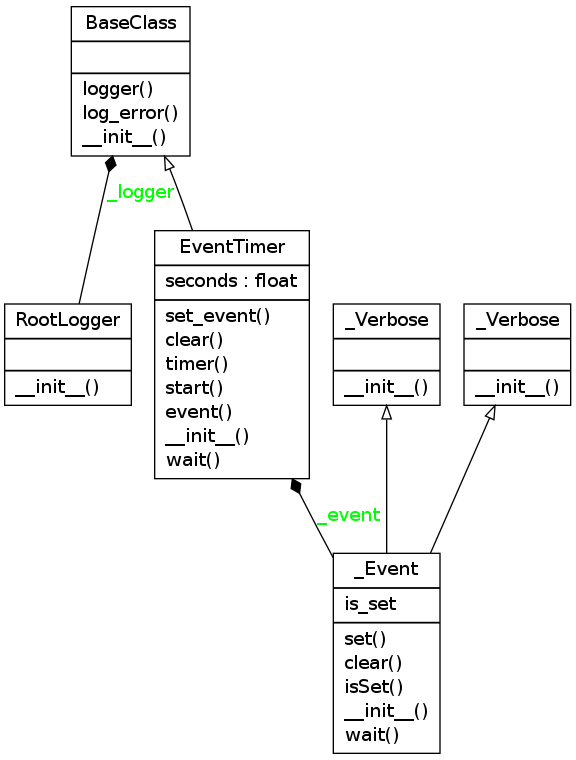
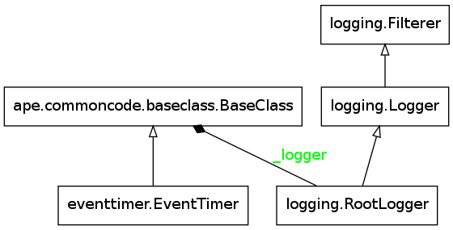

EventTimer
==========

Contents:

    * :ref:`The EventTimer <ape-event-timer>`

    * :ref:`The Wait Decorator <ape-wait-decorator>`

.. _ape-event-timer:

The Event Timer
---------------

An EventTimer will block if you try to make a new request too soon (too soon being something that needs to be empirically determined by the user). It was originally created to prevent calls to a (slow) AP's http server from trying `GET` requests too frequently, as that caused the server to timeout. I think that it will be more useful here as a way to provide even intervals to things that have to make calls at certain times (e.g. code that watches a proc-file).

I've confused myself a bit while trying to remember what this does, so I think I'll elaborate a little more. The `EventTimer` is a thin adapter for threading.event. By itself it will block until the time expires. The :ref:`wait decorator <ape-wait-decorator>` calls this event before executing the method it decorates. If you want to use them to maintain intervals, then, the wait decorator has to decorate a method that will be called once, then that method should be called repeatedly.

.. '

.. currentmodule:: threading
.. autosummary::
   :toctree: api

   Event
   Event.set
   Event.clear
   Event.wait

.. uml::

   EventTimer o- threading.Event
   EventTimer o- threading.Timer
   EventTimer -|> BaseClass
   EventTimer : __init__(event, seconds)   

.. currentmodule:: ape.commoncode.eventtimer
.. autosummary::
   :toctree: api

   EventTimer
   EventTimer.event
   EventTimer.timer
   EventTimer.set_event
   EventTimer.start
   EventTimer.clear
   EventTimer.wait

The Constructor Parameters
--------------------------

The constructor takes two optional parameters.

.. csv-table:: EventTimer Constructor Parameters
   :header: Parameter, Description, Default

   seconds, time to block, 0.5 seconds
   event, threading.event instance, None

The `event` should only be set if this EventTimer has to share its event with other objects. Probably some case with threads, or somesuch... that's not the actual expected use for this.

.. '

A Class Diagram
~~~~~~~~~~~~~~~

An auto-generated class diagram.

.. _ape-wait-decorator:

The ``wait`` Decorator
----------------------

To make using the ``EventTimer`` easier, you can use the ``wait`` decorator. What it does:

    #. Call event.wait in case a previous timer is still running

    #. Clear the event

    #. Call the decorated method

    #. Start the timer

Basic Use::

   @wait
   def do_something(self):
       # do something here after the event-timer expires
       return

.. warning:: This is a method decorator -- it assumes the object it belongs to has a :ref:`timer <ape-event-timer>` property.

.. autosummary::
   :toctree: api

   wait
   

Module Diagram
--------------

A module diagram for this module.

An Example
----------

As a basic example, suppose you want to print 'Able was I ere I saw Elba' every second. You could do something like this::

    class Napolean(object):
        def __init__(self):
            self.timer = EventTimer(seconds=1)

        @wait
        def emit(self):
            print 'Able was I ere I saw Elba'

        def __call__(self):
            while True:
                self.emit()

And this would print the palindrome with 1 second pauses in between::

    speak = Napolean()
    speak()

