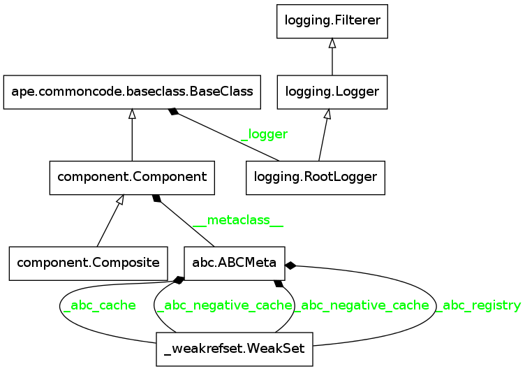
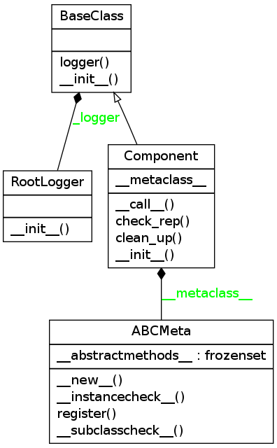
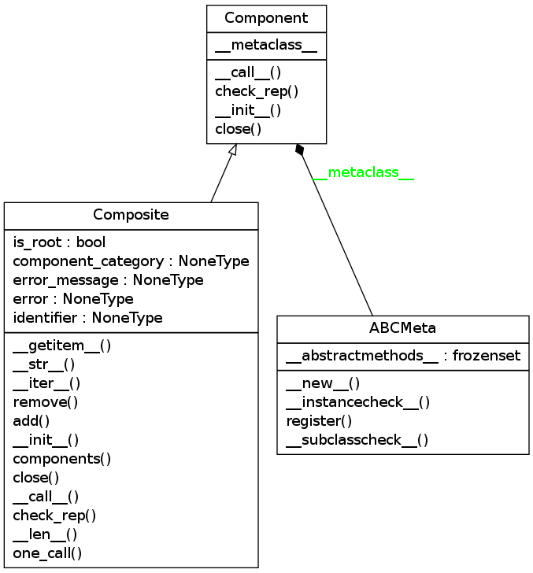

The Components
==============

.. _the-components:

Contents:

    * :ref:`Introduction <components-introduction>`
    * :ref:`Component Module Diagram <component-module-diagram>`
    * :ref:`The Component Class <component-class>`
    * :ref:`The Composite Class <composite-class>`

.. _components-introduction:
Introduction
------------

This is a module to hold classes that (loosely) implement the `Composite Pattern <http://en.wikipedia.org/wiki/Composite_pattern>`_. See the :ref:`Ape Plugin <ape-plugin>` for how the Composites are being used in the `ape` (it is implemented in the `product` property).

.. _component-module-diagram:
Module Diagram
--------------

This is an auto-generated graph of the classes in this module.

.. _component-class:
The Component Class
-------------------

This is the base-class which the other classes will inherit from. All :ref:`Plugin products <base-plugin-product>` should look like this (it doesn't do much so I'm not sure if it's worth it to enforce inheritance).

.. superfluous '

.. uml::

   Component -|> BaseClass
   Component : __call__()
   Component : check_rep()

.. currentmodule:: ape.components.component
.. autosummary::
   :toctree: api

   Component
   Component.__call__
   Component.check_rep

This is an autogenerated version of the class-diagram.

.. _composite-class:
The Composite
-------------

.. uml::

   Composite -|> Component

.. autosummary::
   :toctree: api

   Composite
   Composite.add
   Composite.remove
   Composite.__call__
   Composite.check_rep

The `Composite` is a generalization of the `Hortator`, `Operator` and `Operations`. By specifying the error that it will catch, the error message it will display if there is one, its components, and the component-category of its components, you specify what type of composite it is.

 * Each component call is wrapped by the :ref:`try_except decorator <try-except-decorator>` which catches the Exception in self.error
   

