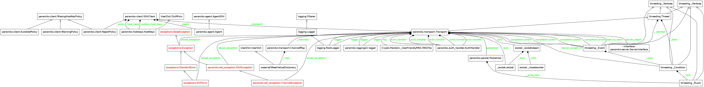
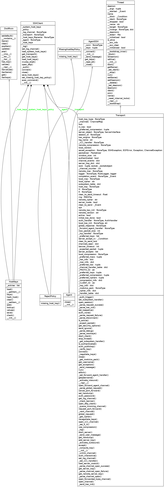

Exploring Paramiko
==================

   Thorazine Advertisement (`source: wikipedia <http://simple.wikipedia.org/wiki/File:Thorazine_advert.jpg>`_)

This is an exploration of `paramiko, <http://www.lag.net/paramiko/>`_ a python implementation of an `SSH client <http://en.wikipedia.org/wiki/Secure_Shell>`_. I will focus primarily on the `SSHClient <http://www.lag.net/paramiko/docs/paramiko.SSHClient-class.html>`_ class that it provides, as this is what I work with the most.

Contents:

    * :ref:`Paramiko's What <paramiko-readme-what>`
    * :ref:`Paramiko's API <paramiko-api>`
    * :ref:`Paramiko Module Diagram <paramiko-module-diagram>`
    * :ref:`Paramiko SSHClient Class Diagram <paramiko-sshclient-class-diagram>`
    * :ref:`A Localhost Experiment <paramiko-localhost-experiment>`
    * :ref:`Paramiko's SSHClient.connect Method <paramiko-sshclient-connect>`
    * :ref:`Paramiko's SSHClient.exec_command Method <paramiko-sshclient-exec_command>`

.. _paramiko-readme-what:

Paramiko What?
--------------

This is taken from the README file:

What
~~~~

    "paramiko" is a combination of the esperanto words for "paranoid" and "friend".  it's a module for python 2.5+ that implements the SSH2 protocol for secure (encrypted and authenticated) connections to remote machines. Unlike SSL (aka TLS), SSH2 protocol does not require hierarchical certificates signed by a powerful central authority. you may know SSH2 as the protocol that replaced telnet and rsh for secure access to remote shells, but the protocol also includes the ability to open arbitrary channels to remote services across the encrypted tunnel (this is how sftp works, for example).

.. '

.. note:: According to `Google Translate <http://translate.google.com/translate_t?safe=off&bav=on.2,or.r_cp.r_qf.&bvm=bv.55819444,d.cGE&biw=1152&bih=651&um=1&ie=UTF-8&hl=en&sl=en&tl=eo&text=paranoid+friend&client=ob>`_ 'paranoid friend' translates to 'paranoja amiko' in esperanto.

.. _paramiko-api:

The API
-------

.. currentmodule:: paramiko
.. autosummary::
   :toctree: api

   SSHClient

.. _paramiko-module-diagram:
   
The Module Diagram
------------------

Let's see what the module looks like.

.. superfluous '

Well, there's a lot there. If nothing else, this might indicate how complicated the SSHClient is.

.. superfluous '
.. _paramiko-sshclient-class-diagram:
   
Class Diagram
-------------

Okay, having looked at the module-dependencies for paramiko.client, let's look at the SSHClient class itself.

.. superfluous '

.. _paramiko-localhost-experiment:

A Localhost Experiment
----------------------

Okay, so now that I see the diagrams and the API, how would I use this to connect to a host? As it turns out I have a user called `fakeuser` on this computer set-up, along with a running open-ssh-server, so let's try a `connect` call.

.. superfluous '

The connect API
~~~~~~~~~~~~~~~

.. currentmodule:: paramiko.client
.. autosummary::
   :toctree: api
   
   SSHClient.connect

The Connect Call
~~~~~~~~~~~~~~~~

::

    client = SSHClient()
    try:
        client.connect('localhost', username='fakeuser')
    except paramiko.SSHException as error:
        print error    
    

::

    Server 'localhost' not found in known_hosts
    

Well, that didn't work. If you look in the docstring for the SSHClient you will see that they recommend making a call to ``client.load_system_host_keys``::

    client = SSHClient
    client.load_system_host_keys()

.. superfluous '

Load System Host Keys API
~~~~~~~~~~~~~~~~~~~~~~~~~

.. autosummary::
   :toctree: api

   SSHClient.load_system_host_keys

    
So, let's try that again.

.. superfluous '

::

    client.load_system_host_keys()
    try:
        client.connect('localhost', username='fakeuser')
    except paramiko.SSHException as error:
        print error
    

::

    Server 'localhost' not found in known_hosts
    

Looking at my earlier code (from the original `ApeTools`), I'm setting the missing-host-key-policy with a method call:

.. superfluous '

::

    # this was in the ape
    client.set_missing_host_key_policy(paramiko.AutoAddPolicy())
    client.load_system_host_keys()
    
    try:
        client.connect('localhost', username='fakeuser')
        stdin, stdout, stderr = client.exec_command('ls')
        for line in stdout:
            print "StdOut: {0}".format(line)
    
    except (IOError, paramiko.SSHException) as error:
        print error
    

::

    StdOut: examples.desktop
    
    StdOut: received_by_tpc_udp_semco__None_ipad_test_{t}.iperf
    
    

Which seems to have fixed it (the output has the files my `fakeuser` has in  the home directory (I used `adduser` to add the `fakeuser` so there's none of the default folders like `Desktop` or `Documents`)).

.. '

The key seems to have been setting the `MissingHostKeyPolicy` to use the `AutoAddPolicy` which seems to mean that it searches a series of default locations to see if the `hostname` is one of the known-hosts. Alternatively, according to the API, you should be able to set a file-name directly.

The Related API
~~~~~~~~~~~~~~~

.. currentmodule:: paramiko.client
.. autosummary::
   :toctree: api
   
   MissingHostKeyPolicy
   AutoAddPolicy

.. currentmodule:: paramiko.hostkeys
.. autosummary::
   :toctree: api
      
   HostKeys

.. currentmodule:: paramiko.agent
.. autosummary::
   :toctree: api
   
   AgentSSH

.. _paramiko-sshclient-connect:   

The SSHClient.connect
---------------------

.. currentmodule:: paramiko.client
.. autosummary::
   :toctree: api

   SSHClient.connect

Now that I know how to get it to work, maybe I can look at what actually happened. This is the the signature for the ``SSHClient.connect`` method::

   SSHClient.connect(hostname, port=22, username=None, password=None, pkey=None, key_filename=None, timeout=None, allow_agent=True, look_for_keys=True, compress=False, sock=None)

And the start of the docstring:

    Connect to an SSH server and authenticate to it. The server's host key is checked against the system host keys (see ``load_system_host_keys``) and any local host keys (``load_host_keys``). If the server's hostname is not found in either set of host keys, the missing host key policy is used (see ``set_missing_host_key_policy``). The default policy is to reject the key and raise an ``SSHException``.

    Authentication is attempted in the following order of priority:

        #. The ``pkey`` or ``key_filename`` passed in (if any)
        #. Any key we can find through an SSH agent
        #. Any ``id_rsa`` or ``id_dsa`` key discoverable in ~/.ssh/
        #. Plain username/password auth, if a password was given

    If a private key requires a password to unlock it, and a password is passed in, that password will be used to attempt to unlock the key.

So looking at that and the `MissingHostKeyPolicy` and `AutoAddPolicy` links above, it looks like the system did not have `localhost` in the list of known hosts and by setting `AutoAddPolicy` I told it to add any unknown hosts I give it to the list of known hosts, fixing it. It seems like there would be no point to having a known hosts file and requiring confirmation for new hosts if you are going to add them automatically, so this is probably some kind of securrity risk. But given that my main use for this will be to talk to my machines on the LAN, this seems to be okay. Luckily I'm not a security expert so I don't know how bad this really might be (ignorance is bliss, though not as much fun as mushrooms, unfortunately).

.. _paramiko-sshclient-exec_command:

The SSHClient exec_command
--------------------------

Now that I've managed to get a connection going it's time to turn my attenttion to actually doing things on the machine. Paramiko has two ways to work with the shell -- interactively using ``invoke_shell`` and non-interactively using ``exec_command``. Since my intention is to use this within code I will focus on the ``exec_command`` method.

.. currentmodule:: paramiko.client
.. autosummary::
   :toctree: api
   
   SSHClient.exec_command
   SSHClient.invoke_shell

There's a few things of interest to note. One is that they've added a timeout so there's no need to sub-class it and add your own to get a timeout (assuming that what it's there for). The second thing to note is that it raises a `paramiko.SSHException` if the server fails to execute the command. Does this mean all errors? What if it's a connectivity problem, does it raise this instead of a `socket.error`? The third (and probably most immediately useful) thing to note is that what you get back is a tuple of (`stdin`, `stdout`, `stderr`). It's important to note the ordering of the returned tuples, as mixing them up will produce unpredictable results (I had standard out and standard in switched in one of the earlier examples and got an `IOError` when I tried to read from standard in -- the error said that the file was closed, which might make sense if you know that I was trying to read from standard in, but it took me a little while to figure it out).

nmap
----

I want to see if paramiko will allow me to run commands as sudo. Since `nmap` will change its behavior (adding MAC addresses) if you run the ping-scan using `sudo` I can run it with and without root privileges and see if I get the expected output.

::

    client = SSHClient()
    client.set_missing_host_key_policy(paramiko.AutoAddPolicy())
    client.connect('localhost', username='fakeuser')
    stdin, stdout, stderr = client.exec_command("nmap -sP '127.0.0.*'")
    for line in stdout:
        print line
    

::

    
    
    Starting Nmap 6.00 ( http://nmap.org ) at 2013-11-04 09:02 PST
    
    Nmap scan report for localhost (127.0.0.1)
    
    Host is up (0.00017s latency).
    
    Nmap scan report for 127.0.0.2
    
    Host is up (0.00011s latency).
    
    Nmap scan report for 127.0.0.3
    
    Host is up (0.000095s latency).
    
    Nmap scan report for 127.0.0.4
    
    Host is up (0.000084s latency).
    
    Nmap scan report for 127.0.0.5
    
    Host is up (0.000074s latency).
    
    Nmap scan report for 127.0.0.6
    
    Host is up (0.000064s latency).
    
    Nmap scan report for 127.0.0.7
    
    Host is up (0.000054s latency).
    
    Nmap scan report for 127.0.0.8
    
    Host is up (0.000043s latency).
    
    Nmap scan report for 127.0.0.9
    
    Host is up (0.000032s latency).
    
    Nmap scan report for 127.0.0.10
    
    Host is up (0.000022s latency).
    
    Nmap scan report for 127.0.0.11
    
    Host is up (0.00024s latency).
    
    Nmap scan report for 127.0.0.12
    
    Host is up (0.00023s latency).
    
    Nmap scan report for 127.0.0.13
    
    Host is up (0.00022s latency).
    
    Nmap scan report for 127.0.0.14
    
    Host is up (0.00020s latency).
    
    Nmap scan report for 127.0.0.15
    
    Host is up (0.00019s latency).
    
    Nmap scan report for 127.0.0.16
    
    Host is up (0.00018s latency).
    
    Nmap scan report for 127.0.0.17
    
    Host is up (0.00017s latency).
    
    Nmap scan report for 127.0.0.18
    
    Host is up (0.00016s latency).
    
    Nmap scan report for 127.0.0.19
    
    Host is up (0.00015s latency).
    
    Nmap scan report for 127.0.0.20
    
    Host is up (0.00014s latency).
    
    Nmap scan report for 127.0.0.21
    
    Host is up (0.00013s latency).
    
    Nmap scan report for 127.0.0.22
    
    Host is up (0.00012s latency).
    
    Nmap scan report for 127.0.0.23
    
    Host is up (0.00011s latency).
    
    Nmap scan report for 127.0.0.24
    
    Host is up (0.00010s latency).
    
    Nmap scan report for 127.0.0.25
    
    Host is up (0.000093s latency).
    
    Nmap scan report for 127.0.0.26
    
    Host is up (0.000082s latency).
    
    Nmap scan report for 127.0.0.27
    
    Host is up (0.000072s latency).
    
    Nmap scan report for 127.0.0.28
    
    Host is up (0.000062s latency).
    
    Nmap scan report for 127.0.0.29
    
    Host is up (0.000052s latency).
    
    Nmap scan report for 127.0.0.30
    
    Host is up (0.000037s latency).
    
    Nmap scan report for 127.0.0.31
    
    Host is up (0.000027s latency).
    
    Nmap scan report for 127.0.0.32
    
    Host is up (0.000017s latency).
    
    Nmap scan report for 127.0.0.33
    
    Host is up (0.00022s latency).
    
    Nmap scan report for 127.0.0.34
    
    Host is up (0.00021s latency).
    
    Nmap scan report for 127.0.0.35
    
    Host is up (0.00041s latency).
    
    Nmap scan report for 127.0.0.36
    
    Host is up (0.00040s latency).
    
    Nmap scan report for 127.0.0.37
    
    Host is up (0.00039s latency).
    
    Nmap scan report for 127.0.0.38
    
    Host is up (0.00038s latency).
    
    Nmap scan report for 127.0.0.39
    
    Host is up (0.00037s latency).
    
    Nmap scan report for 127.0.0.40
    
    Host is up (0.00036s latency).
    
    Nmap scan report for 127.0.0.41
    
    Host is up (0.00035s latency).
    
    Nmap scan report for 127.0.0.42
    
    Host is up (0.00034s latency).
    
    Nmap scan report for 127.0.0.43
    
    Host is up (0.00033s latency).
    
    Nmap scan report for 127.0.0.44
    
    Host is up (0.00032s latency).
    
    Nmap scan report for 127.0.0.45
    
    Host is up (0.00031s latency).
    
    Nmap scan report for 127.0.0.46
    
    Host is up (0.00030s latency).
    
    Nmap scan report for 127.0.0.47
    
    Host is up (0.00029s latency).
    
    Nmap scan report for 127.0.0.48
    
    Host is up (0.00028s latency).
    
    Nmap scan report for 127.0.0.49
    
    Host is up (0.00027s latency).
    
    Nmap scan report for 127.0.0.50
    
    Host is up (0.00026s latency).
    
    Nmap scan report for 127.0.0.51
    
    Host is up (0.00025s latency).
    
    Nmap scan report for 127.0.0.52
    
    Host is up (0.00024s latency).
    
    Nmap scan report for 127.0.0.53
    
    Host is up (0.00023s latency).
    
    Nmap scan report for 127.0.0.54
    
    Host is up (0.00022s latency).
    
    Nmap scan report for 127.0.0.55
    
    Host is up (0.00021s latency).
    
    Nmap scan report for 127.0.0.56
    
    Host is up (0.00020s latency).
    
    Nmap scan report for 127.0.0.57
    
    Host is up (0.00019s latency).
    
    Nmap scan report for 127.0.0.58
    
    Host is up (0.00018s latency).
    
    Nmap scan report for 127.0.0.59
    
    Host is up (0.00017s latency).
    
    Nmap scan report for 127.0.0.60
    
    Host is up (0.00016s latency).
    
    Nmap scan report for 127.0.0.61
    
    Host is up (0.00015s latency).
    
    Nmap scan report for 127.0.0.62
    
    Host is up (0.00014s latency).
    
    Nmap scan report for 127.0.0.63
    
    Host is up (0.00013s latency).
    
    Nmap scan report for 127.0.0.64
    
    Host is up (0.00012s latency).
    
    Nmap scan report for 127.0.0.65
    
    Host is up (0.00011s latency).
    
    Nmap scan report for 127.0.0.66
    
    Host is up (0.00010s latency).
    
    Nmap scan report for 127.0.0.67
    
    Host is up (0.000089s latency).
    
    Nmap scan report for 127.0.0.68
    
    Host is up (0.000079s latency).
    
    Nmap scan report for 127.0.0.69
    
    Host is up (0.000069s latency).
    
    Nmap scan report for 127.0.0.70
    
    Host is up (0.000058s latency).
    
    Nmap scan report for 127.0.0.71
    
    Host is up (0.000047s latency).
    
    Nmap scan report for 127.0.0.72
    
    Host is up (0.000037s latency).
    
    Nmap scan report for 127.0.0.73
    
    Host is up (0.000028s latency).
    
    Nmap scan report for 127.0.0.74
    
    Host is up (0.000018s latency).
    
    Nmap scan report for 127.0.0.75
    
    Host is up (0.00020s latency).
    
    Nmap scan report for 127.0.0.76
    
    Host is up (0.00019s latency).
    
    Nmap scan report for 127.0.0.77
    
    Host is up (0.00055s latency).
    
    Nmap scan report for 127.0.0.78
    
    Host is up (0.00054s latency).
    
    Nmap scan report for 127.0.0.79
    
    Host is up (0.00053s latency).
    
    Nmap scan report for 127.0.0.80
    
    Host is up (0.00052s latency).
    
    Nmap scan report for 127.0.0.81
    
    Host is up (0.00051s latency).
    
    Nmap scan report for 127.0.0.82
    
    Host is up (0.00050s latency).
    
    Nmap scan report for 127.0.0.83
    
    Host is up (0.00049s latency).
    
    Nmap scan report for 127.0.0.84
    
    Host is up (0.00048s latency).
    
    Nmap scan report for 127.0.0.85
    
    Host is up (0.00047s latency).
    
    Nmap scan report for 127.0.0.86
    
    Host is up (0.00046s latency).
    
    Nmap scan report for 127.0.0.87
    
    Host is up (0.00045s latency).
    
    Nmap scan report for 127.0.0.88
    
    Host is up (0.00044s latency).
    
    Nmap scan report for 127.0.0.89
    
    Host is up (0.00043s latency).
    
    Nmap scan report for 127.0.0.90
    
    Host is up (0.00040s latency).
    
    Nmap scan report for 127.0.0.91
    
    Host is up (0.00039s latency).
    
    Nmap scan report for 127.0.0.92
    
    Host is up (0.00037s latency).
    
    Nmap scan report for 127.0.0.93
    
    Host is up (0.00035s latency).
    
    Nmap scan report for 127.0.0.94
    
    Host is up (0.00034s latency).
    
    Nmap scan report for 127.0.0.95
    
    Host is up (0.00033s latency).
    
    Nmap scan report for 127.0.0.96
    
    Host is up (0.00032s latency).
    
    Nmap scan report for 127.0.0.97
    
    Host is up (0.00031s latency).
    
    Nmap scan report for 127.0.0.98
    
    Host is up (0.00030s latency).
    
    Nmap scan report for 127.0.0.99
    
    Host is up (0.00029s latency).
    
    Nmap scan report for 127.0.0.100
    
    Host is up (0.00028s latency).
    
    Nmap scan report for 127.0.0.101
    
    Host is up (0.00027s latency).
    
    Nmap scan report for 127.0.0.102
    
    Host is up (0.00026s latency).
    
    Nmap scan report for 127.0.0.103
    
    Host is up (0.00025s latency).
    
    Nmap scan report for 127.0.0.104
    
    Host is up (0.00024s latency).
    
    Nmap scan report for 127.0.0.105
    
    Host is up (0.00023s latency).
    
    Nmap scan report for 127.0.0.106
    
    Host is up (0.00022s latency).
    
    Nmap scan report for 127.0.0.107
    
    Host is up (0.00021s latency).
    
    Nmap scan report for 127.0.0.108
    
    Host is up (0.00020s latency).
    
    Nmap scan report for 127.0.0.109
    
    Host is up (0.00019s latency).
    
    Nmap scan report for 127.0.0.110
    
    Host is up (0.00018s latency).
    
    Nmap scan report for 127.0.0.111
    
    Host is up (0.00017s latency).
    
    Nmap scan report for 127.0.0.112
    
    Host is up (0.00017s latency).
    
    Nmap scan report for 127.0.0.113
    
    Host is up (0.00015s latency).
    
    Nmap scan report for 127.0.0.114
    
    Host is up (0.00014s latency).
    
    Nmap scan report for 127.0.0.115
    
    Host is up (0.00013s latency).
    
    Nmap scan report for 127.0.0.116
    
    Host is up (0.00012s latency).
    
    Nmap scan report for 127.0.0.117
    
    Host is up (0.00011s latency).
    
    Nmap scan report for 127.0.0.118
    
    Host is up (0.00010s latency).
    
    Nmap scan report for 127.0.0.119
    
    Host is up (0.000086s latency).
    
    Nmap scan report for 127.0.0.120
    
    Host is up (0.000076s latency).
    
    Nmap scan report for 127.0.0.121
    
    Host is up (0.000066s latency).
    
    Nmap scan report for 127.0.0.122
    
    Host is up (0.000057s latency).
    
    Nmap scan report for 127.0.0.123
    
    Host is up (0.000047s latency).
    
    Nmap scan report for 127.0.0.124
    
    Host is up (0.000037s latency).
    
    Nmap scan report for 127.0.0.125
    
    Host is up (0.000027s latency).
    
    Nmap scan report for 127.0.0.126
    
    Host is up (0.000018s latency).
    
    Nmap scan report for 127.0.0.127
    
    Host is up (0.00018s latency).
    
    Nmap scan report for 127.0.0.128
    
    Host is up (0.00018s latency).
    
    Nmap scan report for 127.0.0.129
    
    Host is up (0.00050s latency).
    
    Nmap scan report for 127.0.0.130
    
    Host is up (0.00048s latency).
    
    Nmap scan report for 127.0.0.131
    
    Host is up (0.00047s latency).
    
    Nmap scan report for 127.0.0.132
    
    Host is up (0.00046s latency).
    
    Nmap scan report for 127.0.0.133
    
    Host is up (0.00045s latency).
    
    Nmap scan report for 127.0.0.134
    
    Host is up (0.00044s latency).
    
    Nmap scan report for 127.0.0.135
    
    Host is up (0.00043s latency).
    
    Nmap scan report for 127.0.0.136
    
    Host is up (0.00042s latency).
    
    Nmap scan report for 127.0.0.137
    
    Host is up (0.00041s latency).
    
    Nmap scan report for 127.0.0.138
    
    Host is up (0.00040s latency).
    
    Nmap scan report for 127.0.0.139
    
    Host is up (0.00040s latency).
    
    Nmap scan report for 127.0.0.140
    
    Host is up (0.00038s latency).
    
    Nmap scan report for 127.0.0.141
    
    Host is up (0.00038s latency).
    
    Nmap scan report for 127.0.0.142
    
    Host is up (0.00036s latency).
    
    Nmap scan report for 127.0.0.143
    
    Host is up (0.00036s latency).
    
    Nmap scan report for 127.0.0.144
    
    Host is up (0.00034s latency).
    
    Nmap scan report for 127.0.0.145
    
    Host is up (0.00034s latency).
    
    Nmap scan report for 127.0.0.146
    
    Host is up (0.00033s latency).
    
    Nmap scan report for 127.0.0.147
    
    Host is up (0.00032s latency).
    
    Nmap scan report for 127.0.0.148
    
    Host is up (0.00031s latency).
    
    Nmap scan report for 127.0.0.149
    
    Host is up (0.00030s latency).
    
    Nmap scan report for 127.0.0.150
    
    Host is up (0.00029s latency).
    
    Nmap scan report for 127.0.0.151
    
    Host is up (0.00028s latency).
    
    Nmap scan report for 127.0.0.152
    
    Host is up (0.00027s latency).
    
    Nmap scan report for 127.0.0.153
    
    Host is up (0.00026s latency).
    
    Nmap scan report for 127.0.0.154
    
    Host is up (0.00025s latency).
    
    Nmap scan report for 127.0.0.155
    
    Host is up (0.00024s latency).
    
    Nmap scan report for 127.0.0.156
    
    Host is up (0.00023s latency).
    
    Nmap scan report for 127.0.0.157
    
    Host is up (0.00022s latency).
    
    Nmap scan report for 127.0.0.158
    
    Host is up (0.00021s latency).
    
    Nmap scan report for 127.0.0.159
    
    Host is up (0.00020s latency).
    
    Nmap scan report for 127.0.0.160
    
    Host is up (0.00019s latency).
    
    Nmap scan report for 127.0.0.161
    
    Host is up (0.00018s latency).
    
    Nmap scan report for 127.0.0.162
    
    Host is up (0.00017s latency).
    
    Nmap scan report for 127.0.0.163
    
    Host is up (0.00016s latency).
    
    Nmap scan report for 127.0.0.164
    
    Host is up (0.00015s latency).
    
    Nmap scan report for 127.0.0.165
    
    Host is up (0.00014s latency).
    
    Nmap scan report for 127.0.0.166
    
    Host is up (0.00013s latency).
    
    Nmap scan report for 127.0.0.167
    
    Host is up (0.00012s latency).
    
    Nmap scan report for 127.0.0.168
    
    Host is up (0.00011s latency).
    
    Nmap scan report for 127.0.0.169
    
    Host is up (0.00010s latency).
    
    Nmap scan report for 127.0.0.170
    
    Host is up (0.000093s latency).
    
    Nmap scan report for 127.0.0.171
    
    Host is up (0.000083s latency).
    
    Nmap scan report for 127.0.0.172
    
    Host is up (0.000074s latency).
    
    Nmap scan report for 127.0.0.173
    
    Host is up (0.000063s latency).
    
    Nmap scan report for 127.0.0.174
    
    Host is up (0.000053s latency).
    
    Nmap scan report for 127.0.0.175
    
    Host is up (0.000044s latency).
    
    Nmap scan report for 127.0.0.176
    
    Host is up (0.000034s latency).
    
    Nmap scan report for 127.0.0.177
    
    Host is up (0.000025s latency).
    
    Nmap scan report for 127.0.0.178
    
    Host is up (0.000015s latency).
    
    Nmap scan report for 127.0.0.179
    
    Host is up (0.00017s latency).
    
    Nmap scan report for 127.0.0.180
    
    Host is up (0.00016s latency).
    
    Nmap scan report for 127.0.0.181
    
    Host is up (0.00049s latency).
    
    Nmap scan report for 127.0.0.182
    
    Host is up (0.00048s latency).
    
    Nmap scan report for 127.0.0.183
    
    Host is up (0.00047s latency).
    
    Nmap scan report for 127.0.0.184
    
    Host is up (0.00045s latency).
    
    Nmap scan report for 127.0.0.185
    
    Host is up (0.00045s latency).
    
    Nmap scan report for 127.0.0.186
    
    Host is up (0.00044s latency).
    
    Nmap scan report for 127.0.0.187
    
    Host is up (0.00043s latency).
    
    Nmap scan report for 127.0.0.188
    
    Host is up (0.00042s latency).
    
    Nmap scan report for 127.0.0.189
    
    Host is up (0.00041s latency).
    
    Nmap scan report for 127.0.0.190
    
    Host is up (0.00040s latency).
    
    Nmap scan report for 127.0.0.191
    
    Host is up (0.00039s latency).
    
    Nmap scan report for 127.0.0.192
    
    Host is up (0.00038s latency).
    
    Nmap scan report for 127.0.0.193
    
    Host is up (0.00037s latency).
    
    Nmap scan report for 127.0.0.194
    
    Host is up (0.00036s latency).
    
    Nmap scan report for 127.0.0.195
    
    Host is up (0.00035s latency).
    
    Nmap scan report for 127.0.0.196
    
    Host is up (0.00034s latency).
    
    Nmap scan report for 127.0.0.197
    
    Host is up (0.00033s latency).
    
    Nmap scan report for 127.0.0.198
    
    Host is up (0.00032s latency).
    
    Nmap scan report for 127.0.0.199
    
    Host is up (0.00031s latency).
    
    Nmap scan report for 127.0.0.200
    
    Host is up (0.00030s latency).
    
    Nmap scan report for 127.0.0.201
    
    Host is up (0.00029s latency).
    
    Nmap scan report for 127.0.0.202
    
    Host is up (0.00028s latency).
    
    Nmap scan report for 127.0.0.203
    
    Host is up (0.00027s latency).
    
    Nmap scan report for 127.0.0.204
    
    Host is up (0.00026s latency).
    
    Nmap scan report for 127.0.0.205
    
    Host is up (0.00026s latency).
    
    Nmap scan report for 127.0.0.206
    
    Host is up (0.00024s latency).
    
    Nmap scan report for 127.0.0.207
    
    Host is up (0.00023s latency).
    
    Nmap scan report for 127.0.0.208
    
    Host is up (0.00023s latency).
    
    Nmap scan report for 127.0.0.209
    
    Host is up (0.00022s latency).
    
    Nmap scan report for 127.0.0.210
    
    Host is up (0.00021s latency).
    
    Nmap scan report for 127.0.0.211
    
    Host is up (0.00020s latency).
    
    Nmap scan report for 127.0.0.212
    
    Host is up (0.00019s latency).
    
    Nmap scan report for 127.0.0.213
    
    Host is up (0.00018s latency).
    
    Nmap scan report for 127.0.0.214
    
    Host is up (0.00017s latency).
    
    Nmap scan report for 127.0.0.215
    
    Host is up (0.00016s latency).
    
    Nmap scan report for 127.0.0.216
    
    Host is up (0.00015s latency).
    
    Nmap scan report for 127.0.0.217
    
    Host is up (0.00014s latency).
    
    Nmap scan report for 127.0.0.218
    
    Host is up (0.00013s latency).
    
    Nmap scan report for 127.0.0.219
    
    Host is up (0.00012s latency).
    
    Nmap scan report for 127.0.0.220
    
    Host is up (0.00011s latency).
    
    Nmap scan report for 127.0.0.221
    
    Host is up (0.00010s latency).
    
    Nmap scan report for 127.0.0.222
    
    Host is up (0.000090s latency).
    
    Nmap scan report for 127.0.0.223
    
    Host is up (0.000081s latency).
    
    Nmap scan report for 127.0.0.224
    
    Host is up (0.000072s latency).
    
    Nmap scan report for 127.0.0.225
    
    Host is up (0.000062s latency).
    
    Nmap scan report for 127.0.0.226
    
    Host is up (0.000052s latency).
    
    Nmap scan report for 127.0.0.227
    
    Host is up (0.000042s latency).
    
    Nmap scan report for 127.0.0.228
    
    Host is up (0.000033s latency).
    
    Nmap scan report for 127.0.0.229
    
    Host is up (0.000024s latency).
    
    Nmap scan report for 127.0.0.230
    
    Host is up (0.000015s latency).
    
    Nmap scan report for 127.0.0.231
    
    Host is up (0.00015s latency).
    
    Nmap scan report for 127.0.0.232
    
    Host is up (0.00014s latency).
    
    Nmap scan report for 127.0.0.233
    
    Host is up (0.00017s latency).
    
    Nmap scan report for 127.0.0.234
    
    Host is up (0.00016s latency).
    
    Nmap scan report for 127.0.0.235
    
    Host is up (0.00015s latency).
    
    Nmap scan report for 127.0.0.236
    
    Host is up (0.00014s latency).
    
    Nmap scan report for 127.0.0.237
    
    Host is up (0.00014s latency).
    
    Nmap scan report for 127.0.0.238
    
    Host is up (0.00013s latency).
    
    Nmap scan report for 127.0.0.239
    
    Host is up (0.00012s latency).
    
    Nmap scan report for 127.0.0.240
    
    Host is up (0.00011s latency).
    
    Nmap scan report for 127.0.0.241
    
    Host is up (0.00010s latency).
    
    Nmap scan report for 127.0.0.242
    
    Host is up (0.000093s latency).
    
    Nmap scan report for 127.0.0.243
    
    Host is up (0.000084s latency).
    
    Nmap scan report for 127.0.0.244
    
    Host is up (0.000075s latency).
    
    Nmap scan report for 127.0.0.245
    
    Host is up (0.000066s latency).
    
    Nmap scan report for 127.0.0.246
    
    Host is up (0.000057s latency).
    
    Nmap scan report for 127.0.0.247
    
    Host is up (0.00034s latency).
    
    Nmap scan report for 127.0.0.248
    
    Host is up (0.00033s latency).
    
    Nmap scan report for 127.0.0.249
    
    Host is up (0.00032s latency).
    
    Nmap scan report for 127.0.0.250
    
    Host is up (0.00031s latency).
    
    Nmap scan report for 127.0.0.251
    
    Host is up (0.00030s latency).
    
    Nmap scan report for 127.0.0.252
    
    Host is up (0.00029s latency).
    
    Nmap scan report for 127.0.0.253
    
    Host is up (0.00028s latency).
    
    Nmap scan report for 127.0.0.254
    
    Host is up (0.00027s latency).
    
    Nmap scan report for 127.0.0.255
    
    Host is up (0.00026s latency).
    
    Nmap done: 256 IP addresses (255 hosts up) scanned in 0.03 seconds
    
    

And now with sudo.

::

    pass
    

