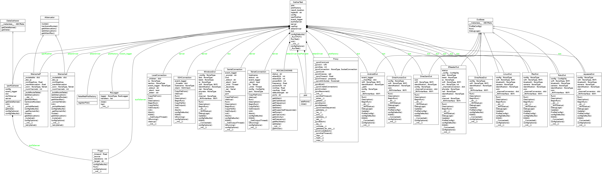

The Automated RVR Gather
========================

This is the code that build's arens RVR runner.

.. superfluous '

Contents:

    * :ref:`API <automatedrvrgather-api>`
    
    * :ref:`Module Diagram <automatedrvrgather-module-diagram>`

    * :ref:`Class Diagram <automatedrvrgather-class-diagram>`

.. _automatedrvrgather-api:

The API
-------

.. currentmodule:: AutomationSuite.AutomatedRVRgather
.. autosummary::
   :toctree: api

   GatherTest
   GatherTest.init
   GatherTest.RunTest
   GatherTest._RunTest
   GatherTest._RunTPOT
   GatherTest.configOptions
   GatherTest.configDefaults
   
.. _automatedrvrgather-module-diagram:

Module Diagram
--------------

.. image:: classes_automatedrvrgather.png

.. _automatedrvrgather-class-diagram:

Class Diagram
-------------

