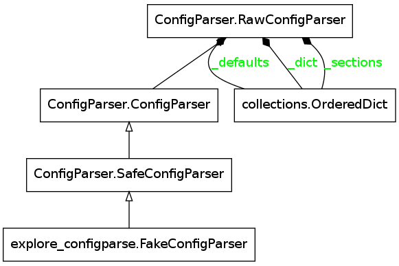

Exploring ConfigParser
======================
.. _exploring-configparser:

Contents:

    * :ref:`SafeConfigParser Reference <exploring-configparser-safeconfigparser>`        

    * :ref:`Case-Sensitivity <exploring-configparser-case-sensitivity>`

    * :ref:`Reading Multiple Files <exploring-configparser-read>`

    * :ref:`Defaults <exploring-configparser-defaults>`

    * :ref:`The Whole Shebang <exploring-configparser-whole-shebang>`

.. _exploring-configparser-safeconfigparser:
SafeConfigParser Reference
--------------------------

.. currentmodule:: ConfigParser
.. autosummary::
   :toctree: api

   SafeConfigParser
   SafeConfigParser.read
   SafeConfigParser.has_section
   SafeConfigParser.has_option
      

We can see how the SafeConfigParser is built using a module graph of a class made here:

::

    class FakeConfigParser(SafeConfigParser):
        pass
    

.. _exploring-configparser-case-sensitivity:
Are options and sections case-sensitive?
----------------------------------------

The config-file:

.. literalinclude:: config_1.ini

::

    case_config = SafeConfigParser()
    case_config.read(FILE_1)
    

Section Case
~~~~~~~~~~~~

::

    print "Matches section camel-case: {0}".format(case_config.has_section('CamelCase'))
    print "Matches section all-caps: {0}".format(case_config.has_section('CAMELCASE'))
    

::

    Matches section camel-case: True
    Matches section all-caps: False
    

Option Case
~~~~~~~~~~~

::

    print "Matches option camel-case: {0}".format(case_config.has_option('CamelCase', 'OptionOne'))
    print "Matches option all-lower: {0}".format(case_config.has_option('CamelCase', 'optionone'))
    

::

    Matches option camel-case: True
    Matches option all-lower: True
    

So it looks like section-names are case-sensitive but option-names are not. What does `optionxform` do?

optionxform
~~~~~~~~~~~

.. autosummary::
   :toctree: api

   SafeConfigParser.optionxform

::

    case_config.optionxform = str
    print "Matches option camel-case: {0}".format(case_config.has_option('CamelCase', 'OptionOne'))
    print "Matches option all-lower: {0}".format(case_config.has_option('CamelCase', 'optionone'))
    

::

    Matches option camel-case: False
    Matches option all-lower: True
    

What?

::

    print case_config.options('CamelCase')
    

::

    ['optionone', 'optiontwo']
    

So it looks like by default `ConfigParser` casts the options to lower-case when they are read in, but since I changed it to be case-sensitive (passing in ``str`` means it uses string-equality to find the option) after reading in the file, it will only match lower-cased option names.

::

    case_config.read(FILE_1)
    print "Matches option camel-case: {0}".format(case_config.has_option('CamelCase', 'OptionOne'))
    print "Matches option all-lower: {0}".format(case_config.has_option('CamelCase', 'optionone'))
    print case_config.options('CamelCase')
    

::

    Matches option camel-case: True
    Matches option all-lower: True
    ['optionone', 'optiontwo', 'OptionOne', 'OptionTwo']
    

Well, that wasn't what I was expecting, but it is good to know -- if you read in a file it adds to the existing section rather than replacing it. One more time.

.. superfluous '

::

    case_config.remove_section('CamelCase')
    case_config.read(FILE_1)
    print "Matches option camel-case: {0}".format(case_config.has_option('CamelCase', 'OptionOne'))
    print "Matches option all-lower: {0}".format(case_config.has_option('CamelCase', 'optionone'))
    print case_config.options('CamelCase')
    

::

    Matches option camel-case: True
    Matches option all-lower: False
    ['OptionOne', 'OptionTwo']
    

Well, that was harder than I thought it would be, but the discovery that the options append leads to the next section.

.. _exploring-configparser-read:
What happens when you use ``read`` more than once?
--------------------------------------------------

If I read the same file twice, what happens to it?

First a print function to create tables for the output:
    
::

    HEADER = """
    .. csv-table:: {section}
       :header: Option,Value
    
    """
    
    LINE = "   {option},{value}"
    
    def print_config(parser):
        """
        Sends a rst csv-table to stdout
    
        :param:
    
         - `parser`: loaded ConfigParser
        """
        try:
            for section in sorted(parser.sections()):
                print HEADER.format(section=section)
                for option,value in parser.items(section):
                    print LINE.format(option=option,
                                      value=value)
        except ConfigParser.Error as error:
            print error
        return
    
    

Now I read the file twice:

::

    safe_config = SafeConfigParser()
    safe_config.read((FILE_1, FILE_1))
    

.. csv-table:: ALLCAPS
   :header: Option,Value

   optionone,1
   optiontwo,2

.. csv-table:: CamelCase
   :header: Option,Value

   optionone,1
   optiontwo,2

That doesn't seem to do anything (so it's safe, as long as you don't mess with the case the way I did). What if you load a similar but different file?

.. superfluous '

The new file:

.. literalinclude:: config_2.ini

Now I read the new file:

::

    safe_config.read(FILE_2)
    

.. csv-table:: ALLCAPS
   :header: Option,Value

   optionone,ONE
   optiontwo,TWO
   optionthree,THREE

.. csv-table:: AllCaps
   :header: Option,Value

   optionone,One
   optiontwo,Two

.. csv-table:: CAMELCASE
   :header: Option,Value

   optionone,ONE
   optiontwo,TWO

.. csv-table:: CamelCase
   :header: Option,Value

   optionone,One
   optiontwo,Two
   optionthree,Three

It appears to behave just like a dictionary (and if you look at the diagram above you can see that the `_sections` attribute is an `OrderedDict`) -- if the section or option exists, it changes the value, if it doesn't it adds the section/option and the value.

.. superfluous '

.. _exploring-configparser-defaults:
How does the DEFAULT section work?
----------------------------------

While somewhat dangerous, using default values can be convenient and can make a file easier to read an maintain. The main drawback, I think, is that if you intend to give this to a non-programmer, trying to troubleshoot errors might be more than they want to deal with. But I suppose that's true of most anything.

.. superfluous '

Does it matter where you put it?

The config-file:

.. literalinclude:: config_3.ini

::

    config = SafeConfigParser()
    config.read(FILE_3)
    

.. csv-table:: NotDefault
   :header: Option,Value

   c,d
   a,a
   b,b
   d,d

So, it looks like you can place the DEFAULT section after the section that references it without any problems. Oddly, though, the 'c' option showed up in the `NotDefault` section. It kind of looks like the DEFAULT is read first, then its values are added to each of the sections.

The config file:

.. literalinclude:: config_4.ini

::

    config = SafeConfigParser()
    config.read(FILE_4)
    

.. csv-table:: FirstSection
   :header: Option,Value

   e,4
   f,d
   a,1
   b,2
   c,3
   d,4

.. csv-table:: SecondSection
   :header: Option,Value

   e,4
   f,d
   a,a
   b,b
   c,c
   d,d

.. csv-table:: ThirdSection
   :header: Option,Value

   e,e
   f,f
   g,u

It does look like everything put in the DEFAULT section is added to the other sections, but the values it adds are replaced if the section defines the same options.

.. _exploring-configparser-whole-shebang:
The Whole Shebang
-----------------

The reason I looked into this was so that I could put a file-glob in a main configuration file and refer to other files so that I can isolate the parts that change or are complicated from the parts that don't... or aren't... I don't yet know if that's a good idea -- nothing to do but to try.

The base-configuration in this directory:

.. literalinclude:: sample_a.ini

The two sub-configurations in the `samples` sub-folder:

.. literalinclude:: samples/sample_b.ini

.. literalinclude:: samples/sample_c.ini

A module to get the filenames:

.. currentmodule:: glob
.. autosummary::
   :toctree: api

   iglob
   
::

    config = SafeConfigParser()
    names = []
    names.extend(config.read(SAMPLE_BASE))
    for name in glob.iglob(config.get('DEFAULT', 'glob')):
        names.extend(config.read(name))
    

.. csv-table:: Section_A
   :header: Option,Value

   hortence,hoo
   glob,samples/sample_*.ini
   lugosi,dead
   bela,abzug

.. csv-table:: Section_B
   :header: Option,Value

   hortence,hoo
   glob,samples/sample_*.ini
   how,now
   brown,cow
   what,hoo

.. csv-table:: Section_C
   :header: Option,Value

   hortence,hoo
   glob,samples/sample_*.ini
   in_a_boat,False
   with_a_goat,False
   i_am,hoo

So what we got was:

    * Section_A is a composite of DEFAULT, and the two Section_A sections from the sub-files

    * Section_B and Section_C used the DEFAULT `hortence` to complete themselves

    * None of the Sections were in the original file, they were composed from the sub-files found by the glob

I didn't notice it before, but the ConfigParser is returning the name of the file it reads. I don't know how useful this is since you pass in the filename, but I guess there was a reason for it.

::

    print "\nFilenames Read:"
    for name in names:
        print "   {0}".format(name)
    

::

    
    Filenames Read:
       sample_a.ini
       samples/sample_c.ini
       samples/sample_b.ini
    

