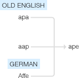

TheApe
======

This is an attempt to re-start the `Project Arachne` revision of the `APE` (the All-in-one Program Executor). It is being re-designed as a code runner as well as a repository of code components for building programs.

   Google's etymology

**ape (n.)**
Old English *apa* "ape, monkey," from Proto-Germanic *apan (cf. Old Saxon apo, Old Norse api, Dutch aap, German affe), perhaps borrowed in Proto-Germanic from Celtic (cf. Old Irish apa) or Slavic (cf. Old Bohemian op, Slovak opitza), perhaps ultimately from a non-Indo-European language. 

Apes were noted in medieval times for mimicry of human action, hence, perhaps, the other figurative use of the word, to mean "a fool." To go ape (in emphatic form, go apeshit) "go crazy" is 1955, U.S. slang. To lead apes in hell (1570s) was the fancied fate of one who died an old maid.

Source: `Online Etymology Dictionary <http://www.etymonline.com/index.php?term=ape>`_ 

Written Documentation
---------------------

This is the more organized documentation written outside of the code.

.. toctree::
   :maxdepth: 1

   User Documentation <documentation/user/index>
   Developer Documentation <documentation/developer/index>

Auto-Generated Documentation
----------------------------

These are the documents created from the source files.

.. toctree::
   :maxdepth: 1

   Log Setter <log_setter.rst>
   The Main Entry Point <main.rst>

.. toctree::
   :maxdepth: 1

   The Components <components/index.rst>
   Parts <parts/index.rst>
   Plugins <plugins/index.rst>
   Common Code <commoncode/index.rst>
   User Interface <interface/index.rst>

