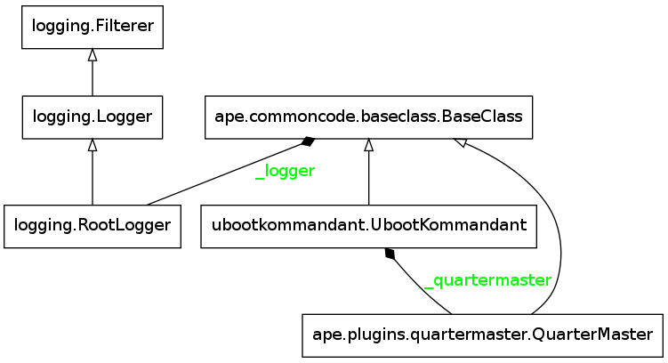
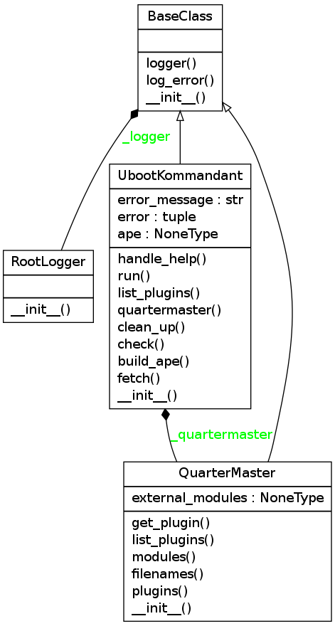

The UbootKommandant
===================
.. currentmodule:: ape.interface.ubootkommandant

Contents:

    * :ref:`Introduction <uboot-kommandant>`
    * :ref:`UML Class Model <ubootkommandant-class-model>`
    * :ref:`Module Diagram <ubootkommandant-module-diagram>`
    * :ref:`Class Implementation Diagram <ubootkommandant-class-diagram>`
    * :ref:`Error Explanations <ubootkommandant-errors>`
    * :ref:`UbootKommandant API <ubootkommandant-api>`

.. _uboot-kommandant:

This is a holder of sub-commands for the :ref:`ArgumentClinic <argument-clinic>`. The name was chosen because in re-starting the APE I found myself accidentally editing the wrong emacs buffer (the old file vs the new file) and wanted something distinct. Once the APE goes back to being the lone package maybe I'll find something less idiosyncratic. Or maybe not.

.. superfluous '

.. _ubootkommandant-class-model:

Class Model
-----------

.. uml::

   UbootKommandant o- QuarterMaster
   UbootKommandant --|> BaseClass

.. _ubootkommandant-module-diagram:

Module Diagram
--------------

.. _ubootkommandant-class-diagram:

Class Diagram
-------------

.. _ubootkommandant-errors:

The Errors
----------

There are two kinds of exceptions caught which produce two error-messages:

.. csv-table:: Error Messages
   :header: Exception, Message, Meaning
   :delim: ;

   Exception; Oops, I Crapped My Pants; Something unexpected happened -- this indicates a problem with the code
   KeyboardInterrupt; Oh, I am slain; User killed the runtime for some reason -- clean-up and then close
   

.. _ubootkommandant-api:

The API
-------

The decorator (:ref:`try_except <try-except-decorator>`) around most of these methods is blocking the docstrings. Follow the links to the source code to see what they do.

.. autosummary::
   :toctree: api

   UbootKommandant
   UbootKommandant.handle_help
   UbootKommandant.run
   UbootKommandant.fetch
   UbootKommandant.list_plugins
   UbootKommandant.check
   UbootKommandant.clean_up

