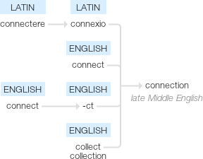

Connections
=====

.. _ape-connections:

   Google's etymology

.. '   

**connection (n.)**
late 14c., conneccion, later connexioun (mid-15c.), from Old French connexion, from Latin connexionem (nominative connexio) "a binding or joining together," from *connexare, frequentative of conectere "to fasten together, to tie, join together," from com- "together" (see com-) + nectere "to bind, tie" (see nexus).

Spelling shifted from connexion to connection (especially in American English) mid-18c. under influence of connect, abetted by affection, direction, etc.

source: `Online Etymology Dictionary <http://etymonline.com/?term=connection>`_
   

.. toctree::
   :maxdepth: 1

   The SSH Connection <sshconnection.rst>

.. toctree::
   :maxdepth: 1

