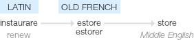

Storage
=======

.. _ape-storage:

The parts contained herein implement a file-like interface to store and retrieve data.

**store** (n.) 
    c.1300, "that with which a household, camp, etc. is stored," from store (v.). Sense of "sufficient supply (of anything)" is attested from late 15c. The meaning "place where goods are kept for sale" is first recorded 1721 in American English (British prefers shop). Stores "articles and equipment for an army" is from 1630s. In store "laid up for future use" (also of events, etc.) is recorded from late 14c. Store-bought is attested from 1952, American English; earlier store-boughten (1883).

source : `Online Etymology Dictionary <http://www.etymonline.com/index.php?term=store>`_

   
   Google's etymology

.. toctree::
   :maxdepth: 1

   Testing the SocketStorage <testsocketstorage.rst>
   Testing the Screen Storage <testscreenstorage.rst>
   Testing the Storage Composite <teststoragecomposite.rst>
   The Storage Composite <storagecomposite.rst>
   File Storage <filestorage.rst>
   The Base Storage <base_storage.rst>
   Screen Storage <screenstorage.rst>
   Socket Storage <socketstorage.rst>

.. toctree::
   :maxdepth: 1

