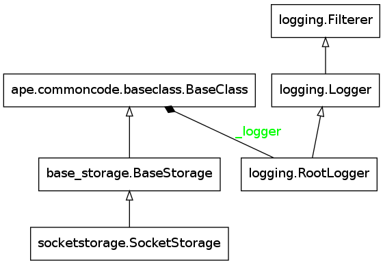

Socket Storage
==============

.. _ape-socket-storage:

This is a module for classes that implement a file-like interface to a socket. Its main purpose is to catch socket timeout errors.

.. _socket-storage-model:

SocketStorage Model
-------------------

Not all of the methods make sense (like open) so only a sub-set will be implemented. The assumption will be that a file-like object was created elsewhere and passed in to the constructor.

.. uml::

   SocketStorage -|> BaseStorage
   SocketStorage :  __init__(file)
   SocketStorage : close()
   SocketStorage : String read()
   SocketStorage : String readline()
   SocketStorage : List readlines()
   SocketStorage : write(text)
   SocketStorage : writeline(text)
   SocketStorage : writelines(list)
   SocketStorage : closed
   SocketStorage : name
   SocketStorage : __iter__()

.. _socket-storage-api:

SocketStorage API
-----------------

.. currentmodule:: ape.parts.storage.socketstorage
.. autosummary::
   :toctree: api

   SocketStorage
   SocketStorage.close
   SocketStorage.write
   SocketStorage.writeline
   SocketStorage.writelines
   SocketStorage.readline
   SocketStorage.readlines
   SocketStorage.read
   SocketStorage.__iter__

Although the main reason for this class is to trap socket timeouts when reading lines, it will raise an ApeError when an attempt is made to read the entire buffer (i.e. read readlines) so that if it is really an error to have a timeout, these methods can be used instead. Generally, the main interface is assumed to be the __iter__ method, though, which will catch the timeouts forever, returning the socketstorage.TIMED_OUT string (copying python's socket.timeout message-string).

.. '

.. _socket-storage-module-diagram:

Module Diagram
--------------

[Errno 2] No such file or directory
Is pylint installed?

.. .. _socket-storage-class-diagram:
.. 
.. Class Diagram
.. -------------
.. 
.. <<name='class_diagram', echo=False, results='sphinx'>>=
.. if IN_PWEAVE:
..     class_diagram_file = class_diagram(class_name="SocketStorage",
..                                        filter='OTHER',
..                                        module=this_file)
..     print ".. image:: {0}".format(class_diagram_file)
.. 