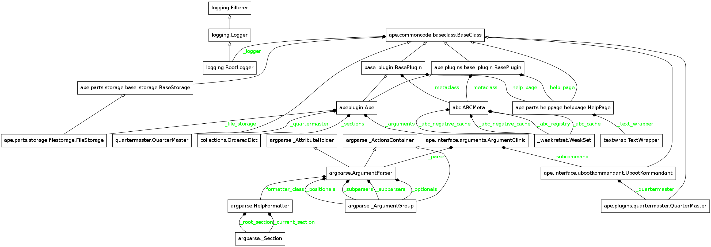
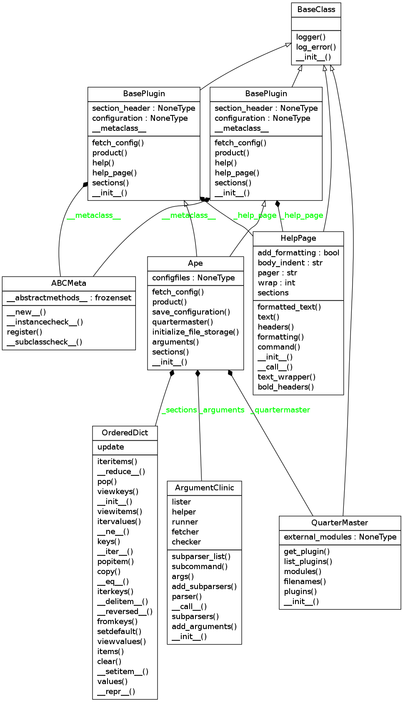

The Ape Plugin
==============

.. _ape-plugin:
This is the plugin that creates the Hortator to run :ref:`Composites <composite-class>`. It will be used when the `run` subcommand is called by the user.

Contents:

    * :ref:`Introduction <apeplugin-introduction>`

    * :ref:`Errors <apeplugin-errors>`

    * :ref:`Run Sub-command State Diagram <apeplugin-run-state-diagram>`

    * :ref:`Module Dependency-Graph <apeplugin-module-dependency-graph>`

    * :ref:`Class Implementation Diagram <apeplugin-class-diagram>`

    * :ref:`API <apeplugin-api>`

    * :ref:`External Plugins <apeplugin-external-plugins>`

    * :ref:`Figuring Out the Help <apeplugin-help>`

.. _apeplugin-introduction:    
    
Introduction
------------

Rather than implementing separate classes for the different levels of Composites used in executing the `run` sub-command of the APE, a single composite is defined which accepts error and message specifications (and composes :ref:`Components <component-class>`) to define the particular instance of the Composite.

.. uml::

   Component --|> BaseClass
   Composite --|> Component
   Leaf --|> Component
   Hortator --|> Composite
   Operator --|> Composite
   Operation --|> Composite
   Hortator "1" o- "1..*" Operator
   Operator "1" o- "1..*" Operation
   Operation "1" o- "1..*" Leaf

The `Hortator`, `Operator` and `Operation` are instances of the Composite and so aren't functionally different but they catch different levels of exceptions so that there can be a certain level of self-recovery and error handling. Each execution of the `ape` will have one `Hortator` composed of `Operators` (one `Operator` per configuration file with an `APE` section). Each line in the APE will correspond to an `Operation` composed of `Leafs` (one `Leaf` per item on the comma-separated line). Each Leaf is a plugin's product. Thus when a plugin is created, the product should inherit from the `Component` class in order to make sure it has the same interface.

The reason for differentiating the three Composites is to allow different levels of error handling.  For instance, differentiating `Operation` vs  `Operator`  allows the user to decide on a set of plugins that will be called even if the first set crashes. e.g.::

    [APE]
    op_1 = WatchRSSI,IperfSession
    op_2 = CleanUp

When translated to objects, this configuration would create one `Operation` composite for each line and both lines would be composed in an `Operator` (and if there are multiple config-files with ``[APE]`` sections, an `Operator` will be created for each and all `Operators` will be composed in the `Hortator`). If one of the `Leafs` in `op_1` (`WatchRSSI` or `IperfSession`) crashes in a predictable way (raising an `ApeError` or the equivalent) then the `op_2` Leaf (CleanUp) should still be executed. The reason for only catching ape-defined exceptions is so that if something is really wrong with the code or system and another exception is raised (either a python-built-in exception or from an external third-party package), it will be assumed that the configuration is un-runnable and the Hortator will move on to the next `Operator`.

.. _apeplugin-errors:

The Errors
----------

.. uml::

   ApeError --|> Exception
   DontCatchError --|> Exception

Since the two errors are siblings, catching the ``ApeError`` won't catch the `DontCatchError`.

.. superfluous '   

 * The `Operation` composite runs its `Leafs` and lets the errors propagate (so any errors will stop it)

 * The `Operator` runs its `Operations` and traps `ApeErrors` so that it can try all its `Operations`, allowing any clean-up `Leafs` to be run

 * The `Hortator` runs its `Operators` and traps all errors (except KeyboardInterrupts), preventing one `Operator` from stopping the others

.. _apeplugin-run-state-diagram:
 
The Run State Diagram
---------------------

The assumed flow for the ``run`` sub-command is something like this:

.. digraph:: run_state_diagram

   rankdir = LR
   pa [label="Parse Args"]
   bc [label="Build Map"]
   bo [label="Build Composites"]
   run [label="Run", shape=diamond]
   data [label="Data", shape=rect]
   start [label="Start", shape=diamond]
   configurations [label="Configurations", shape=rect]
   
   start -> pa [label="args"]
   pa -> bc [label="name"]
   configurations -> bc [label="config"]
   bc -> bo [label="map"]
   bo -> run [label="Hortator"]
   run -> data [label="datum"]

This means:
   
 * The `Parse Args` state has been reached before this plugin is created.

 * The `Build Map` uses a `ConfigurationMap <configuration-map>`

 * the `Build Composites` happens in creating the ``product`` 
   

.. _apeplugin-module-dependency-graph:

Module Dependency Graph
-----------------------

This is an auto-generated graph of this module.

.. _apeplugin-class-diagram:

Class Diagram
-------------

This is an auto-generated class diagram for the Ape.

And this is a hand-drawn one which should be easier to read but is not guaranteed to be up-to-date.

.. uml::

   Ape --|> BasePlugin
   Ape o-- HelpPage
   Ape o-- Composite
   Ape o-- QuarterMaster
   Ape o-- ConfigurationMap
   Ape o-- FileStorage

.. _apeplugin-api:

The API
-------

.. currentmodule:: ape.plugins.apeplugin   
.. autosummary::
   :toctree: api

   Ape
   Ape.help
   Ape.product
   Ape.fetch_config
   Ape.arguments
   Ape.sections

.. warning:: The ConfigParser adds all options in the DEFAULT section to the other sections. I am assuming that anything in the DEFAULT section that is the same as something in the APE section (same option:value) should be ignored.
   

.. _apeplugin-help:

The Help
--------

To print the help-message the Ape will use the help page, but since it is the default plugin it needs to construct things like the arguments and such. To keep it dynamic I am going to try and use the ArgumentParser instance. Here are the experiments.

.. currentmodule:: argparse
.. autosummary::
   
   argparse.ArgumentParser.format_usage

::

    if output_documentation:
        arguments = ArgumentClinic()
        arguments.add_arguments()
        arguments.add_subparsers()
        parser = arguments.parser
        print parser.format_usage()
    

::

    usage: ape.interface [-h] [--debug] [--silent] [--pudb] [--pdb] [--trace]
                         [--callgraph]
                         {run,fetch,list,check,help} ...
    
    

Well, that might be kind of useful, although the program name is wrong and it does not show the sub-parser arguments.

::

    if output_documentation:
        parser.prog = 'ape'
        print parser.format_help()
    

::

    usage: ape [-h] [--debug] [--silent] [--pudb] [--pdb] [--trace] [--callgraph]
               {run,fetch,list,check,help} ...
    
    optional arguments:
      -h, --help            show this help message and exit
      --debug               Sets the logging level to debug
      --silent              Sets the logging level to off (for stdout)
      --pudb                Enables the pudb debugger
      --pdb                 Enables the pdb debugger
      --trace               Turn on code-tracing
      --callgraph           Create call-graph
    
    Sub-Commands Help:
      Available Subcommands
    
      {run,fetch,list,check,help}
                            SubCommands
        run                 Run the Ape
        fetch               Fetch a sample config file.
        list                List available plugins.
        check               Check your setup.
        help                Show more help
    
    

Not really... most of the arguments actually go to the sub-commands but they are not shown.

After stepping through the code it looks like this is going to be more effort than it is worth, the sub-parsers are themselves instances of ArgumentParser and that simple help message being printed is going through quite a bit of code to get built up. I think I will just write it out for now.

Another Way
~~~~~~~~~~~

After taking a break I decided to just add the sub-commands to the ArgumentClinic as properties, that way I can try to query them directly.

.. currentmodule:: ape.interface.arguments
.. autosummary::
   :toctree: api

   ArgumentClinic

::

    if output_documentation:
        subs = (arguments.runner, arguments.fetcher,
                arguments.lister, arguments.checker, arguments.helper)
    
        program = 'ape[.\w]*'
        expression = re.compile(program)
        for sub in subs:
            print expression.sub('ape', sub.format_usage().replace('usage: ', ''))
    

::

    ape run [-h] [<config-file list> [<config-file list> ...]]
    
    ape fetch [-h] [--modules [MODULES [MODULES ...]]]
                               [names [names ...]]
    
    ape list [-h] [--modules [MODULES [MODULES ...]]]
    
    ape check [-h] [--modules [MODULES [MODULES ...]]]
                               [<config-file list> [<config-file list> ...]]
    
    ape help [-h] [-w WIDTH] [--modules [MODULES [MODULES ...]]]
                              [name]
    
    

The regular-expression substitution is to get rid of the extra package name while still keeping the sub-command, otherwise it says ``ape.interface``.

.. _apeplugin-external-plugins:

Using External Plugins
----------------------

In order to allow the execution of plugins that are not a part of the ``ape``, I am allowing the declaration of 
modules in the configuration file::

    [MODULES]
    package.module

Or something similar. The ape will search modules named in the MODULES section for children of the `ape.plugins.base_plugin.BasePlugin` class and load and call them if found. The idea is that rather than having to mix up the ape and other packages, a `sandbox` package can be setup with plugins that act as the interface between the `ape` and the other package(s).

Using the `FakePlugin` created for the :ref:`Exploring External Imports <exploring-external-imports>` section, the config file for the ape could look something like this::

    [APE]
    operation_1 = FakePlugin

    [MODULES]
    fakepackage.fakeplugin

    [FAKEPLUGIN]
    option = value

The FakePlugin returns a :ref:`DummyClass <dummy-class>` as its `product` so the FAKEPLUGIN section doesn't really do anything.

