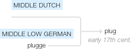

Plugins
=======

.. _plugins-folder:
This is a folder to contain plugins. Plugins are meant to be the code available for the user to pick (via the configuration file). This differentiates them from :ref:`parts <ape-parts>` which are available to plugin-creators to use but not meant to be used directly by the end user (if a component can be used a plugin front-end should be built for it).

**plug** (n.) 

    1620s, originally a seamen's term, probably from Dutch plug, Middle Dutch plugge "bung, stopper," related to Norwegian plugg, Danish ploeg, North Frisian plaak, Middle Low German pluck, German Pflock; ultimate origin uncertain. Irish and Gaelic words are from English. Sense of "wad or stick of tobacco" is attested from 1728, based on resemblance. Electrical sense is from 1883, based on being inserted; meaning "sparking device in an internal combustion engine" is from 1886. Meaning "advertisement" first recorded 1902, American English, perhaps from verb sense "work energetically at" (c.1865).

source: `Online Etymology Dictionary <http://www.etymonline.com/index.php?term=plug>`_

   Etymology Tree from google

Auto-Generated Documentation
----------------------------

These are the documents created from the source files.

.. toctree::
   :maxdepth: 1

   The QuarterMaster <quartermaster.rst>
   The Ape Plugin <apeplugin.rst>
   The Base Plugin <base_plugin.rst>
   The Dummy Plugin <dummyplugin.rst>

.. toctree::
   :maxdepth: 1

