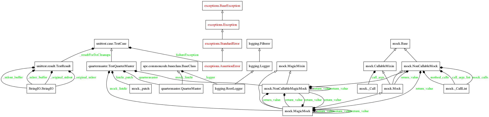
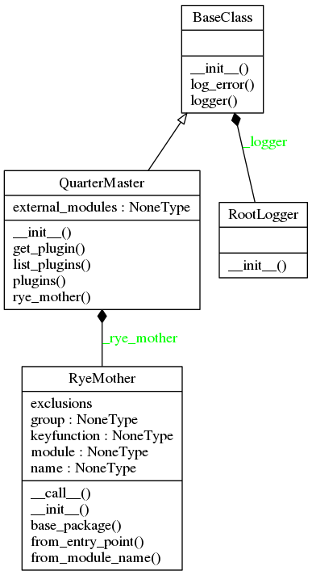

The QuarterMaster
=================

.. currentmodule:: ape.plugins.quartermaster

The `QuarterMaster <http://en.wikipedia.org/wiki/Quartermaster>`_ handles finding and interacting with the plugins.

.. uml::

   QuarterMaster -|> BaseClass

.. _ape-plugins-quartermaster:   

Public Methods and Properties
-----------------------------

These are the public attributes of the `QuarterMaster`. Only `get_plugin` and `list_plugins` are meant for users, the others are building blocks.

.. autosummary::
   :toctree: api

   QuarterMaster
   QuarterMaster.list_plugins
   QuarterMaster.filenames
   QuarterMaster.modules
   QuarterMaster.plugins
   QuarterMaster.get_plugin

Auto-Generated Diagrams
-----------------------

These are auto-generated so they will always be more up-to-date than the previous class-diagrams, but they tend to be harder to read as well (and are just not pretty) so I will leave both in.

Some Messy Business
-------------------

Since I am running code to create this documentation I am going to keep it from executing when it is not being compiled as documentation by setting up a flag. It is ugly, but I do not know how to exclude code from the tangling::

   document_this = __name__ == "__builtin__"

Background
----------

One of the purposes of the QuarterMaster is to find plugins for the rest of the code to use or to list them for the user. I had previously tried three methods to do something similar to this:

    #. Explicit Imports

    #. Naming Conventions

    #. `yapsy <http://yapsy.sourceforge.net/>`_

For the explicit imports I created a class and added properties that would import and return the class definitions, something like::

    class ImportClass(object):
        def __init__(self):
            self._aoeu = None
            return

        @property
        def aoeu(self):
            if self._aoeou is None:
                from aoeu import Aoeu
                self._aoeu = Aoeu
            return self._aoeu

The reason for the use of properties was so that if a specific class wasn't needed it wouldn't be imported. This worked okay as a quick hack, but as the classes piled up it quickly became too large (and it is just too inelegant). My attempt at using naming conventions (having all modules and classes have the same suffix) seemed too inflexible and clumsy. Yapsy seems like it would work, but having to dig through the API and do experiments to figure out how to get it working was proving to be too much work for the limited use I wanted out of it. So my solution here is to use the python standard library and a common base-class to create a primitive self-discovering plugin manager (the `QuarterMaster`). It will do file-discovery within the plugins directory to find candidate files, import their contents, then check to see which ones inherit from the :ref:`BasePlugin <base-plugin>`.

Gathering Files
~~~~~~~~~~~~~~~

The first step is to gather the file-names of potential plugins. Potential plugins in this case are python files in the same directory as the QuarterMaster. To illustrate the next examples I am going to use the ``base_plugin`` module since it is in the same directory and I need a file I can import.

The `os.listdir <http://docs.python.org/2/library/os.html#files-and-directories>`_ function takes a path string and returns a list of entries in the directory in arbitrary order (other than hidden directories). So we need the path to the ``plugins`` directory. In this case I am putting the `QuarterMaster` in the same directory so it is a matter of the QuarterMaster knowing its own directory. If you look at the `import <http://docs.python.org/2/reference/simple_stmts.html#import>`_ statement you will see that whenever a module is imported, it gets a `__file__` variable added to its namespace:

.. currentmodule:: os
.. autosummary::

   os.listdir
   os.path.dirname

::

    if document_this:
        import ape.plugins.base_plugin as base_plugin
        print base_plugin.__file__
    

::

    /home/moira/repositories/repository_code/hortators/ape/ape/plugins/base_plugin.pyc
    

Looking at the output you can see that the ``__file__`` contains the path to the compiled bytecode of the module. To get the `path` we want for the ``listdir`` function we can use `os.path.dirname <http://docs.python.org/2/library/os.path.html#module-os.path>`_ which takes a path and returns the directory without the file-name. So, with these three elements, and the fact that python files have the `.py` extension, we can find all the files in the same directory as that of a particular module:

::

    if document_this:
        path = os.path.dirname(base_plugin.__file__)
        for name in sorted(name for name in os.listdir(path) if name.endswith('.py')):
            print name
    

::

    __init__.py
    apeplugin.py
    base_plugin.py
    dummyplugin.py
    index.py
    quartermaster.py
    sleep_plugin.py
    

I should point out, since it might not be obvious, that the classes within a module get the ``__file__`` variable added to their namespace as a global variable so the QuarterMaster can just use the ``__file__`` variable directly without importing anything (so in the QuarterMaster you will see ``__file__``, not ``base_plugin.__file__``) but the code I run while documenting this module cannot get access to it without referring to an imported module. I think it has to do with the fact that the import statement is what creates the variable so if this module were imported it would be created, but to generate the document, I run it through Pweave. Just keep that in mind if you look at the code.

Anyway, did that work? Yes and no. Notice that it only printed out file-names, not the whole path. If we use this as the base for importing (after removing the extension) it will work for this documentation because I have to compile it while in the same directory, but the moment you run the code anywhere else python will raise an error (unless you happen to be in a directory with files of the same name). So do we just add the paths? That was my first notion, but this will raise an error when you try to import it. It  looks like ``importlib`` is importing a file, but the name you are passing in is actually the name of the module, not the file. This can be confusing but it just means that instead of the file-path, you need to refer to the module the way you would when you import it, using dot-notation::

    import ape.plugins.apeplugin

So how do we get this? Well, it turns out that import creates another variable in a module-namespace called ``__package__`` which contains the dotted-notation path to the package where the module is located. This was confusing to me at first (and I may still be wrong), but basically packages correspond to directories and modules correspond to files, but they are *not* files and directories and they are not referred to in the same way that the file-system would refer to them. The file-names still have their extensions so I will add the package prefix later, but this is what is in the ``__package__``:

::

    if document_this:
        print base_plugin.__package__
    
    

::

    ape.plugins
    
    

    
Finding the Plugins
~~~~~~~~~~~~~~~~~~~

To figure out if something in a file we have discovered is a Plugin we need to know that it is a child of the ``BasePlugin``. To do that we need to import it then check that its ``__base__`` property is the ``BasePlugin``. What we created previously was a list of strings (file-names), the next step is to get rid of the file extension using ``os.path.splitext`` (which returns a (basename, extension) tuple created from a file name) and import those basenames using the `importlib <http://docs.python.org/2/library/importlib.html>`_ module.

Besides filtering on the extension, I am also going to exclude some other files because importing them executes all the code in them and I am getting extraneous strings appearing in the output for this documentation. Also, once the extension is removed from the name I prepend the package. The import module says that it takes the package name as an argument, but that uses relative importing so there would be some dot-notation to figure out. This seems easier.

.. currentmodule:: importlib

.. autosummary::

   importlib.import_module
   
::

    if document_this:
        # remember we need the package
        package = base_plugin.__package__
        exclude = "__init__.py index.py constants.py quartermaster.py".split()
        names = sorted(name for name in os.listdir(path)
                       if name.endswith('.py') and not name in exclude)
        basenames_extensions = (os.path.splitext(name) for name in names)
        modules = (importlib.import_module('.'.join((package, base))) for base, extension in basenames_extensions)
    

At this point there is nothing really interesting to print yet -- we need to find the things in the modules that are plugins. To get the objects in the modules we can use the `inspect.getmembers <http://docs.python.org/2/library/inspect.html#inspect.getmembers>`_ function. Once we have them, we can check the ``__base__`` variable that each class has which holds the parent class. Only classes have the ``__base__`` attribute so we will also filter non-classes out using the `inspect.isclass <http://docs.python.org/2/library/inspect.html#inspect.getmembers>`_ function to prevent AttributeErrors.

The signature of the ``getmembers`` function is this::

    inspect.getmembers(object[, predicate])

The `predicate` argument is an optional function that you pass in to filter what ``getmembers`` returns. ``getmembers`` will only return objects that evaluate to True when passed to the predicate function, so if we pass in a function that checks if an object is the child of the BasePlugin, this should give us our plugins:

.. currentmodule:: inspect

.. autosummary::

   inspect.isclass
   inspect.getmembers

.. warning:: It looks like importing python-standard-library classes will not give them a ``__base__`` attribute so the ``is_plugin`` has to trap for ``AttributeError`` exceptions or any python file that imports a python standard library module has to be excluded from the files that are imported.

::

    if document_this:
        isclass = inspect.isclass
        def is_plugin(o):
            return isclass(o) and o.__base__ is BasePlugin
                
        for module in modules:
            members = inspect.getmembers(module,
                                         predicate=is_plugin)
            for member in members:
                # each member is a tuple
                name, definition = member
                print name
                plugin = definition(None)
    

Oops. What happened there (the ``print`` statement should have created some output above this paragraph)? Well, it turns out that now that we are using the full import path, we need to add the full path for ``BasePlugin`` when we do our check or it will fail.

.. currentmodule:: os

.. autosummary::

   os.path.splitext

   
::

    if document_this:
        import ape.plugins.base_plugin
        names = sorted(name for name in os.listdir(path)
                       if name.endswith('.py') and not name in exclude)
        basenames_extensions = (os.path.splitext(name) for name in names)
        modules = (importlib.import_module('.'.join((package, base))) for base, extension in basenames_extensions)
    
        def is_plugin(o):
            return isclass(o) and o.__base__ is ape.plugins.base_plugin.BasePlugin
        
        for module in modules:
            members = inspect.getmembers(module,
                                         predicate=is_plugin)
            for member in members:
                # each member is a tuple
                name, definition = member
                print name
                plugin = definition(None)
    

::

    Ape
    CrashTestDummy
    Dummy
    StuckDummy
    Sleep
    

The actual instantiation of the plugin (``plugin = definition(None)``) was done to show that it is a callable object (a Plugin class definition in this case).

