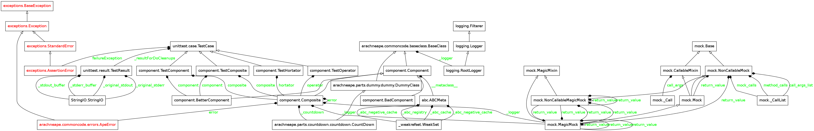
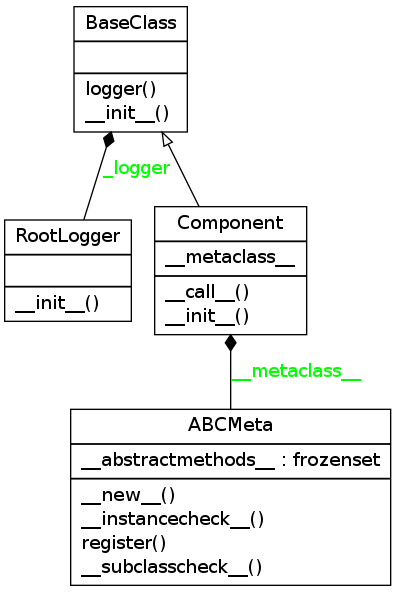
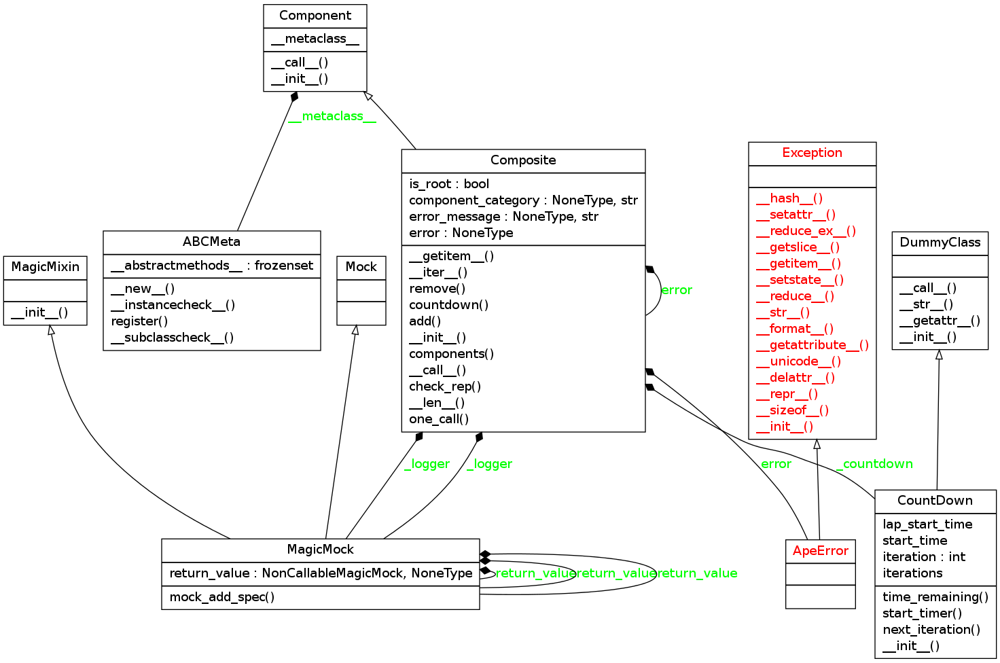

The Components
==============

.. _the-components:

Contents:

    * :ref:`Introduction <components-introduction>`
    * :ref:`Component Module Diagram <component-module-diagram>`
    * :ref:`The Component Class <component-class>`
    * :ref:`The Composite Class <composite-class>`

.. _components-introduction:
Introduction
------------

This is a module to hold classes that (loosely) implement the `Composite Pattern <http://en.wikipedia.org/wiki/Composite_pattern>`_. Rather than implementing separate classes for the different levels of Composites used in executing the `run` sub-command of the APE, a single composite is defined which accepts error and message specification (as well as component addition) to define the particular instance of the Composite.

.. uml::

   Component --|> BaseClass
   Composite --|> Component
   Leaf --|> Component
   Hortator --|> Composite
   Operator --|> Composite
   Operation --|> Composite
   Hortator "1" o- "1..*" Operator
   Operator "1" o- "1..*" Operation
   Operation "1" o- "1..*" Leaf

The `Hortator`, `Operator` and `Operation` aren't functionally different but they catch different levels of exceptions so that there can be a certain level of self-recovery and error handling. Each execution of the `ape` will have one `Hortator` composed of `Operators` (one `Operator` per configuration file with an `ARACHNEAPE` section). Each line in the ARACHNEAPE will correspond to an `Operation` composed of `Leafs` (one `Leaf` per item on the comma-separated line). Each Leaf will match one-to-one with a plugin's product. Thus when a plugin is created, the product should inherit from the `Component` class in order to make sure it has the same interface.

The reason for differentiating the three Composites is to allow different levels of error handling.  For instance, differentiating `Operation` vs  `Operator`  allows the user to decide on a set of plugin that will be called even if the first set crashes. e.g.::

    [ARACHNEAPE]
    op_1 = WatchRSSI,IperfSession
    op_2 = CleanUp

When translated to objects, this configuration would create one `Operation` composite for each line and both lines would be composed in an `Operator` (and if there are multiple config-files with [ARACHNEAPE] sections, each of the Operators will be composed in the Hortator). If one of the Leafs in `op_1` (WatchRSSI or IperfSession) crashes in a predictable way (raising an `ApeError`) then the `op_2` Leaf (CleanUp) should still be executed. The reason for only catching arachneape-defined exceptions is so that if something is really wrong with the code or system, it will be assumed that this configuration is un-runnable and the Hortator will move on to the next `Operator`.

.. _component-module-diagram:
Module Diagram
--------------

This is an auto-generated graph of the classes in this module.

.. _component-class:
The Component Class
-------------------

This is the base-class which the other classes will inherit from. All :ref:`Plugin products <base-plugin-product>` should look like this (it doesn't do much so I'm not sure if it's worth it to enforce inheritance).

.. superfluous '

.. uml::

   Component -|> BaseClass

.. currentmodule:: arachneape.components.component
.. autosummary::
   :toctree: api

   Component
   Component.__call__

This is an autogenerated version of the class-diagram.

.. _composite-class:
The Composite
-------------

.. uml::

   Composite -|> Component

.. autosummary::
   :toctree: api

   Composite

The `Composite` is a generalization of the `Hortator`, `Operator` and `Operations`. By specifying the error that it will catch, the error message it will display if there is one, its components, and the component-category of its components, you specify what type of composite it is.

 * Each component call is wrapped by the :ref:`try_except decorator <try-except-decorator>` which catches the Exception in self.error
   

The Errors
----------

The hierarchy of errors is as follows:

.. uml::

   LeafError -|> ApeError

This is somewhat confusing so I will try to explain how the exception hierarchy is meant to work. Each plugin will build a product that is an instance of a Leaf. If a known or predictable error occurs, it will raise a `LeafError` (or some child or sibling of the LeafError). The leaf error is based on the `ApeError` rather than the `OperatorError` as `parts` of the `arachneape` will raise errors based on this as well so any part or plugin that has a predictable but unsalvageable error will cause the `Operation` to die but not the `Operator`, which will move on to the next Operation. If an Exception is raised that is not a sub-class of the `ApeError` then it is deemed unexpected and the `Operation` will not catch it, allowing the error to propagate  Because individual Operators should not affect each other, the Hortator will catch any Exceptions from the Operator and try to move on to the next Operator.

 * The `Operation` runs its `Leafs` and lets the errors propagate (so any raised will stop it)

 * The `Operator` runs its `Operations` and traps `ApeErrors` so that it can try all its `Operations`, allowing any clean-up `Leafs` to be run

 * The `Hortator` runs its `Operators` and traps all errors (except KeyboardInterrupts), preventing one `Operator` from stopping the others

::

    class BadComponent(Component):
        def __init__(self):
            return
    
    class BetterComponent(Component):
        def __call__(self):
            return
    
    class TestComponent(unittest.TestCase):
        def setUp(self):
            self.composite = Composite()
            self.component = BetterComponent()
            return
        
        def test_bad_component(self):
            """
            Does it raise a TypeError if you do not implement the __call__?
            """
            self.assertRaises(TypeError, BadComponent)
            BetterComponent()
            return
    

::

    class TestComposite(unittest.TestCase):
        def setUp(self):
            self.composite = Composite()
            self.component = BetterComponent()
            return
        
        def test_add_component(self):
            self.composite.add(self.component)
            self.composite.add(self.component)
            self.assertEqual(1, len(self.composite))
            self.assertIn(self.component, self.composite)
            return
    
        def test_remove_component(self):
            self.composite.add(self.component)
            self.composite.remove(self.component)
            return
    
        def test_slice(self):
            self.composite.add(self.component)
            # indexing
            self.assertEqual(self.component, self.composite[-1])
            component = BetterComponent()
            self.composite.add(component)
            # slicing
            self.assertEqual([self.component, component], self.composite[:])
            return
    
        def test_check_rep(self):
            self.composite.error = ApeError
            self.composite.error_message = "Die antwoort ist nicht in die aufreissen."
            self.composite.component_category = "Piltdown Mann"
            # this should not raise an error
            self.composite.check_rep()
    
            # error cannot be None
            self.composite.error = None
            self.assertRaises(ConfigurationError, self.composite.check_rep)
    
            # error must be exception
            self.composite.error = Composite
            self.assertRaises(ConfigurationError, self.composite.check_rep)
    
            self.composite.error = ApeError
            self.composite.error_message = None
            self.assertRaises(ConfigurationError, self.composite.check_rep)
    
            self.composite.error_message = 'Ausgezeichnet.'
            self.composite.component_category = None
            self.assertRaises(ConfigurationError, self.composite.check_rep)
            return
    
    

::

    class TestHortator(unittest.TestCase):
        def setUp(self):
            self.hortator = Composite(error=Exception,
                                      error_message="Operator Crash",
                                      component_category='Operator')
            return
    
        def test_exception(self):
            bad_operator = MagicMock(side_effect =Exception('bad operator1'))        
            next_operator = MagicMock()
            self.hortator._logger = MagicMock()
            self.hortator.add(bad_operator)
            self.hortator.add(next_operator)
            self.hortator()
            return
    

::

    class TestOperator(unittest.TestCase):
        def setUp(self):
            self.operator = Composite(error=ApeError,
                                      error_message='Operation Crash',
                                      component_category='Operation')
            self.operator._logger = MagicMock()
            return
    
        def test_exception(self):
            component = MagicMock(side_effect=ApeError)
            component_2 = MagicMock()
            self.operator.add(component)
            self.operator.add(component_2)
            self.operator()
            # the composite should catch the ApeError and move on to component_2
            component_2.assert_called_with()
    
            # component_3 raises an Exception that should not be caught
            component_3 = MagicMock(side_effect=Exception)
            self.operator.add(component_3)
    
            # countdown isn't meant to re-run (bug?)
            self.operator._countdown = None
    
            self.assertEqual(3, len(self.operator))
            
            # but it should not catch an Exception
            self.assertRaises(Exception, self.operator)
            return
    

.. autosummary::
   :toctree:

   TestComponent.test_bad_component
