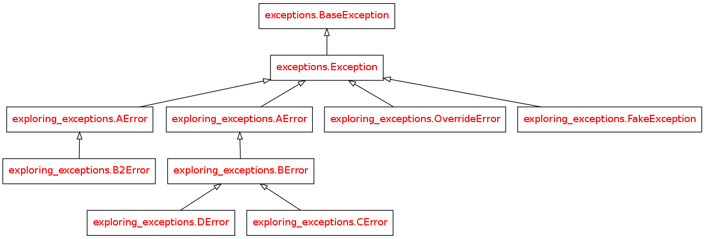
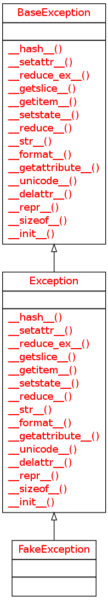

Exploring Exceptions
====================

Background
----------

Since the `arachneape` does not know ahead of time what code it will be running it becomes difficult ahead of time to know what exceptions to catch and what not to catch. To make this standardized it will assume that if the base `Exception` is raised then something completely unexpected happened and it will dump the traceback and quit. Each level of the infratructure will only catch the error that matches the level they are calling. The `Hortator`, for instance, will only catch `OperatorErrors` while the `Operators` will only catch `PluginErrors`. To get a better understanding of how the inheritance mechanism works and how changing the constructor affects what it does, the following experiments will be performed.

What Makes up the Exception?
----------------------------

To understand the base Exception we can create a class that inherits from it and see what it acquires.

.. currentmodule:: exceptions
.. autosummary::
   :toctree: api

   Exception
   Exception.__init__

::

    class FakeException(Exception):
        pass
    

Although the autosummary of the Exception says 'non-exit exceptions' the documentation says:

   All built-in, non-system-exiting exceptions are derived from this class. All user-defined exceptions should also be derived from this class.

What does overriding init do?
-----------------------------

The diagrams didn't really tell us much so I will try to confirm my expectations using some simple experiments. First, the `python tutorial <http://docs.python.org/2/tutorial/errors.html#user-defined-exceptions>`_ shows an example of overriding the constructor. Does this really help us?

.. superfluous '

::

    class OverrideError(Exception):
        def __init__(self, bum, phillips, message):
            self.bum = bum
            self.phillips = phillips
            self.message = message
    def raise_bum_phillips(bum, phillips):
        if bum != 'tramp':
            raise OverrideError(bum=bum,
                                phillips=phillips,
                                message='I killed a {0} with my {1}'.format(bum, phillips))
    
    try:
        raise_bum_phillips('tramp', 'pino')
        raise_bum_phillips('hobo', 'screwdriver')
    except OverrideError as error:
        print "Bum Type: {0}".format(error.bum)
        print "Phillips Classification: {0}".format(error.phillips)
        print error.message
    

::

    Bum Type: hobo
    Phillips Classification: screwdriver
    I killed a hobo with my screwdriver
    

This might be useful for propagating specific information upwards, but might also prove to burdensome to keep track of what is in the exception. I can only see doing it if knowing certain values would change the behavior of the code, but maybe I'll think of something else later.

Does the hierarchy allow for more control over what gets caught and what doesn't?
---------------------------------------------------------------------------------

Let's try a simple tree of aggregated Exceptions.

.. superfluous '

.. digraph:: exception_tree

   AError -> BError
   BError -> CError
   BError -> DError

::

    class AError(Exception):
        def __init__(self, name, rank, message):
            self.name = name
            self.rank = rank
            self.message = message
            return
    
    class BError(AError):
        pass
    
    class CError(BError):
        pass
    
    class DError(BError):
        pass
    

And now some functions that raise these Exceptions.

::

    def d_run(name, rank):
        """
        :raise: DError
        """
        raise DError(name=name, rank=rank, message='{0} not like'.format(name))
    
    def c_run(name, rank):
        """
        :raise: CError
        """
        raise CError(name=name, rank=rank, message='My name is {0} and I approve this message'.format(name))
    
    def b_run(name, rank, children):
        """
        :raise: BError
        """
        print "b_run says:"
        if children == 'c':
            try:
                c_run('cable', 'cougar')
            except CError as error:
                print error
            try:
                c_run('crusty', 'captain')
            except DError as error:
                # DError is a sibling to CError, you can't catch them
                print "This Won't Show"
        elif children == 'd':
            try:
                d_run('dan', 'donkey')
            except DError as error:
                print error
            try:
                d_run('don', 'diablo')
            except CError as error:
                #CError is a sibling to DError
                print "This won't show"
        raise BError(name, rank, '{1} says: What the hell do I do with "{0}"?'.format(children,
                                                                         name))
        
    def fatal_error():
        """
        :raise: AError
        """
        raise AError('adolph', 'arschloch', "Catch this or die.")
    
    def a_run():
        """
        Calls b_run, catches BError exceptions and below
        """
        errors = []
        try:
            # this raises a CError, child of BError
            b_run('bob', 'builder', 'c')
        except BError as error:
            errors.append(error)
        try:
            # this raises a DError, child of BError
            b_run('babe', 'bilder', 'd')        
        except BError as error:
            errors.append(error)
        try:
            # this raises a BError
            b_run('brunhilde', 'butterball', 'e')
        except BError as error:
            print error
    
        print "a_run says:"
        for error in errors:
            if error.name == 'don':
                print "{0} is dead".format(error.rank)
            else:
                print "I never much cared for {0} {1}.".format(error.rank,
                                                               error.name)
        # fatal_error raises AError, parent of BError
        try:
            fatal_error()
        except BError as error:
            print "This won't be seen."
            print error.message
    
    try:
        a_run()
    except AError as error:
        print "\nAError:"
        print error.message    
    

::

    b_run says:
    
    b_run says:
    
    b_run says:
    
    a_run says:
    I never much cared for captain crusty.
    diablo is dead
    
    AError:
    Catch this or die.
    

Only the print statements from ``a_run`` seem to have made it to ``stdout`` -- does that mean the ones in ``b_run`` weren't reached, or that they just don't get output here? Running this with python outside of the documentation shows that the ``b_run`` print messages don't reach standard out. Maybe if I run ``b_run`` by itself it will change.

.. superfluous '

::

    try:
        b_run('bob', 'builder', 'c')
    except BError as error:
        print error
    

::

    b_run says:
    
    
    

Nope. It turns out that the reason it didn't print was because in overriding the constructor I messed up the string representation somehow. You can fix it, though, by defining the ``__str__`` method.

.. superfluous '

::

    class AError(Exception):
        def __init__(self, name, rank, message):
            self.name = name
            self.rank = rank
            self.message = message
            return
    
        def __str__(self):
            return "{0}: {1}".format(self.__class__.__name__, self.message)
    

::

    try:
        a_run()
    except AError as error:
        print "Un-Caught:"
        print error
    

::

    b_run says:
    CError: My name is cable and I approve this message
    b_run says:
    DError: dan not like
    b_run says:
    BError: brunhilde says: What the hell do I do with "e"?
    a_run says:
    I never much cared for captain crusty.
    diablo is dead
    Un-Caught:
    AError: Catch this or die.
    

Summary
-------

By overriding the constructor you can create specific attributes that can be set up when an exception is raised which then allows the handler of the exception to make conditional choices for what to do next. Also, catching the parent-exception will catch all the child-exceptions, but catching an Exception won't catch its siblings' exceptions. The sibling-thing doesn't seem quite so important, but the parent-child relationship should prove useful, as long as added code respects it to some degree -- meaning that no one catches exceptions higher than their level within the hierarchy.
