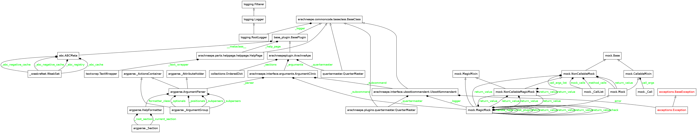
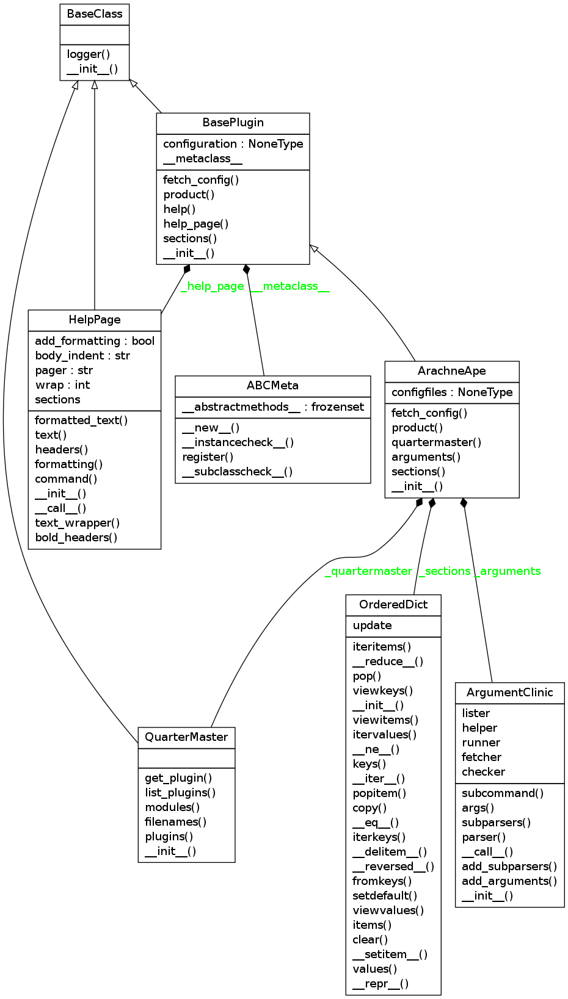

The ArachneApe Plugin
=====================

This is the plugin that the Hortator to run Composites. It will always be used when the `run` subcommand is used.

The Run State Diagram
---------------------

The assumed flow for the ``run`` sub-command is something like this:

.. digraph:: run_state_diagram

   rankdir = LR
   pa [label="Parse Args"]
   bc [label="Build Map"]
   bo [label="Build Composites"]
   run [label="Run", shape=diamond]
   data [label="Data", shape=rect]
   start [label="Start", shape=diamond]
   configurations [label="Configurations", shape=rect]
   
   start -> pa [label="args"]
   pa -> bc [label="name"]
   configurations -> bc [label="config"]
   bc -> bo [label="map"]
   bo -> run [label="Hortator"]
   run -> data [label="datum"]

 * The `Parse Args` state has been reached before this plugin is created.

 * The `Build Map` uses a `ConfigurationMap <configuration-map>`

 * the `Build Composites` happens in creating the ``product`` 
   

Module Dependency Graph
-----------------------

This is an auto-generated graph of this module.

Class Diagram
-------------

This is an auto-generated class diagram for the ArachneApe.

And this is a hand-drawn one which should be easier to read but may not guaranteed to be up-to-date.

.. uml::

   ArachneApe --|> BasePlugin
   ArachneApe o-- HelpPage
   ArachneApe o-- Composite

.. currentmodule:: arachneape.plugins.arachneapeplugin   
.. autosummary::
   :toctree: api

   ArachneApe
   ArachneApe.help
   ArachneApe.product
   ArachneApe.fetch_config
   ArachneApe.arguments
   ArachneApe.sections

.. warning:: The ConfigParser adds all options in the DEFAULT section to the other sections. Although declaring the same option in other sections will override the DEFAULT, there is no clean way to tell if it was updated
   

The Help
--------

To print the help-message the ArachneApe will use the help page, but since it is the default plugin it needs to construct things like the arguments and such. To keep it dynamic I am going to try and use the ArgumentParser instance. Here are the experiments.

.. currentmodule:: argparse
.. autosummary::
   
   argparse.ArgumentParser.format_usage

::

    if output_documentation:
        arguments = ArgumentClinic()
        arguments.add_arguments()
        arguments.add_subparsers()
        parser = arguments.parser
        print parser.format_usage()
    

::

    usage: arachneape.interface [-h] [--debug] [--silent] [--pudb] [--pdb]
                                [--trace] [--callgraph]
                                {run,fetch,list,check,help} ...
    
    

Well, that might be kind of useful, although the program name is wrong and it does not show the sub-parser arguments.

::

    if output_documentation:
        parser.prog = 'arachneape'
        print parser.format_help()
    

::

    usage: arachneape [-h] [--debug] [--silent] [--pudb] [--pdb] [--trace]
                      [--callgraph]
                      {run,fetch,list,check,help} ...
    
    optional arguments:
      -h, --help            show this help message and exit
      --debug               Sets the logging level to debug
      --silent              Sets the logging level to off (for stdout)
      --pudb                Enables the pudb debugger
      --pdb                 Enables the pdb debugger
      --trace               Turn on code-tracing
      --callgraph           Create call-graph
    
    Sub-Commands Help:
      Available Subcommands
    
      {run,fetch,list,check,help}
                            SubCommands
        run                 Run the ArachneApe
        fetch               Fetch a sample config file.
        list                List available plugins.
        check               Check your setup.
        help                Show more help
    
    

Not really... most of the arguments actually go to the sub-commands but they are not shown.

After stepping through the code it looks like this is going to be more effort than it is worth, the sub-parsers are themselves instances of ArgumentParser and that simple help message being printed is going through quite a bit of code to get built up. I think I will just write it out for now.

Another Way
~~~~~~~~~~~

After taking a break I decided to just add the sub-commands to the ArgumentClinic as properties, that way I can try to query them directly.

.. currentmodule:: arachneape.interface.arguments
.. autosummary::
   :toctree: api

   ArgumentClinic

::

    if output_documentation:
        subs = (arguments.runner, arguments.fetcher,
                arguments.lister, arguments.checker, arguments.helper)
    
        program = 'arachneape[.\w]*'
        expression = re.compile(program)
        for sub in subs:
            print expression.sub('arachneape', sub.format_usage().replace('usage: ', ''))
    

::

    arachneape run [-h]
                                    [<config-file list> [<config-file list> ...]]
    
    arachneape fetch [-h] [names [names ...]]
    
    arachneape list [-h]
    
    arachneape check [-h]
                                      
                                      [<config-file list> [<config-file list> ...]]
    
    arachneape help [-h] [-w WIDTH] [name]
    
    

The regular-expression substitution is to get rid of the extra package name while still keeping the sub-command, otherwise it says ``arachneape.interface``.
