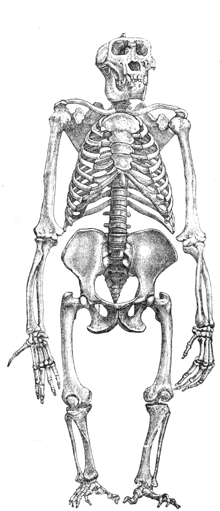

The Ape's Infrastructure
========================

   Original image `source <http://commons.wikimedia.org/wiki/File:Primatenskelett-drawing.jpg>`_

.. toctree::
   :maxdepth: 1

   BaseClass <baseclass.rst>
   Code Graphs <code_graphs.rst>
   The Composite <composite.rst>
   The Configuration Map <configurationmap.rst>
   Crash Handler <crash_handler.rst>
   Errors <errors.rst>
   Index Builder <indexbuilder.rst>
   The Rye Mother <ryemother.rst>
   The Singletons <singletons.rst>
   Time Maps <timemap.rst>

.. toctree::
   :maxdepth: 1

   The Arguments <arguments/index.rst>

