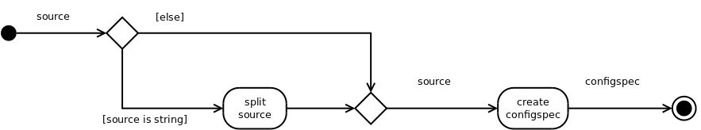

The Base Plugin
===============
.. module:: theape.plugins.base_plugin

.. _base-plugin:

Background
----------

This module contains a `BasePlugin` class that forms the foundation of the `ape` plugin-system. Creating a `BasePlugin` makes it easier to add code as it provides a concrete target for the person adding the code, removes the need for the infrastructure code to be changed when plugins are added, and encourages documentation by providing a built-in online help-interface and auto-included `rst` files.

In order to create a child of the `BasePlugin` you are required to implement two properties and one method: ``sections``, ``product``, and ``fetch_config()``. The ``sections`` and ``fetch_config`` are for the user-interface while the ``product`` should be the object to run. The ``sections`` can be ``None`` if you do not want the online help, but should otherwise be a dictionary with section-names as keys and content-strings as values. It will be passed to the :ref:`HelpPage <help-page>` so you should see that if you want to know what will be done with the ``sections`` property. If the ordering is important use a ``collections.OrderedDict``. The
``fetch_config`` is expected to be a method that sends a sample config-file snippet to stdout. I chose stdout rather than to disk because it allows the user to append it to existing files using redirection ``>>`` and it also serves as a prompt for those who just need to remember what the configuration should look like (I also had problems with users accidentally clobbering their configurations by pulling sample files). The ``product`` should be the built-object for the code to run (only the ``__call__`` method will be used so that has to be implemented on the ``product``). When the child-plugin is implemented, it will be passed a `ConfigObj`.

The :ref:`QuarterMaster <quarter-master>` looks for child-classes of the `BasePlugin` when deciding what is a valid plugin, so besides defining an implementation expectation for the new plugin, the `BasePlugin` also provides the means for inclusion in the `ape` (even if you drop a module in this folder, if nothing in it is a child of the `BasePlugin` it will be ignored). To check if it contains a `BasePlugin` the module has to be imported so be careful with globals and imports.

The `BasePlugin` class and the ``plugins`` package also provides the foundation for user help. As noted above, the ``sections`` and ``fetch_config`` are meant for online help and in addition to this the ``index.pnw`` file contains code to include any ``rst`` files in the ``plugins`` directory so adding documentation files here will add the text to the documentation when it is regenerated::

   Pweave index.pnw

To summarize, the `BasePlugin` is the main way to add code that will be exposed to the end user.

.. warning:: I have had a lot of problems troubleshooting when I accidentally name plugin-class the same thing as (one of) the class(es) it's building -- the re-definition of the name will wipe out your imported name. Don't do it. (e.g. don't create a plugin named Sample that builds a class named Sample as its product.)

.. '

Class Diagram
-------------

This is an (idealized) class diagram (see below for an auto-generated one).
    
.. uml::

   BaseClass <|-- BasePlugin
   BaseClass : logger
   BasePlugin : configuration
   BasePlugin o- HelpPage
   BasePlugin : sections
   BasePlugin : product
   BasePlugin : help(width)
   BasePlugin : fetch_config()
   BasePlugin : section_header

Public Properties and Methods
-----------------------------

The following are the public propeties and methods. The ``help_page`` and ``help()`` are the only implemented attributes, the rest need to be implemented by the inheriting classes.

.. _base-plugin-sections:
Sections
~~~~~~~~

The `sections` are a dictionary used by the help-page to create the screen-output. By defining this dictionary you are defining what the user will see when they enter::

    ape help <plugin-name>

.. _base-plugin-product:
The Product
~~~~~~~~~~~

This is the built object that client code will call. To make the interface uniform it is assumed that all parameters have been set and none will be passed to the __call__() method.

.. _base-fetch-config::
The Fetch Config
~~~~~~~~~~~~~~~~

The `fetch_config` method used to copy an example configuration file to the current working directory (thus its name). Since each plugin can provide its own sample, I decided that they should instead output them to standard out. Thus the user could do something like this::

    ape fetch > ape.ini
    ape fetch IperfSession >> ape.ini

And so on to add to a configuration file without clobbering the old one. Additionally, the APE looks for a `config_glob` option in the APE section so the other configuration files could be put in a separate file and shared by other APE configurations.    
   
.. autosummary:: 
   :toctree: api

   BasePlugin
   BasePlugin.sections
   BasePlugin.help_page
   BasePlugin.help
   BasePlugin.product
   BasePlugin.fetch_config

Aggregated Classes
------------------

These are the classes that the BasePlugin uses.

.. module:: theape.commoncode.baseclass
.. autosummary::
   :toctree: api

   BaseClass.logger

.. module:: theape.parts.helppage.helppage
.. autosummary::
   :toctree: api

   HelpPage
   HelpPage.__call__
     

.. Module Graph
.. ------------
.. 
.. <<name='module_graph', echo=False, results='sphinx'>>=
.. if in_pweave:
..     from theape.plugins.base_plugin import BasePlugin
..     print "This is a module diagram for **{0}**.\n".format(BasePlugin.__module__)
..     this_file = os.path.join(os.getcwd(), 'base_plugin.py')
..     module_diagram_file = module_diagram(module=this_file, project='baseplugin')
..     print ".. image:: {0}".format(module_diagram_file)
.. 
.. @

.. Class Diagram
.. -------------
.. 
.. This is an auto-generated diagram of the BasePlugin class.
..     
.. <<name='class_diagram', echo=False, results='sphinx'>>=
.. if in_pweave:
..     class_diagram_file = class_diagram(class_name="BasePlugin",
..                                        filter='OTHER',
..                                        module=this_file)
..     print ".. image:: {0}".format(class_diagram_file)
.. @

.. _ape-SubConfiguration:

The SubConfiguration
--------------------

SubConfigurationConstants
~~~~~~~~~~~~~~~~~~~~~~~~~

A holder of constants for the ``SubConfiguration`` so other code can reference them.

.. code:: python

    class SubConfigurationConstants(object):
        """
        Holder of SubConfiguration constants
        """
        __slots__ = ()
        plugin_option ='plugin'
        updates_section_option = 'updates_section'
        error_name = 'ConfigurationError'
        bad_option_message = "Option '{option}' in section '{section}' failed validation (error='{error}', should be {option_type})"
        missing_option_message = "Option '{option}' in section '{section}' of type {option_type} for plugin '{plugin}' required but missing"
        missing_section_message = "Section '{section}' to configure '{plugin}' not found in configuration"
        missing_plugin_option_message = "'plugin' option missing in section '{0}'"
        missing_plugin_replacement = "<non-plugin>"
        extra_message = "Extra {item_type} in section [{section}] - '{name}'"
        check_rep_failure_message = "Errors in section [{0}] in the configuration"

The SubConfiguration Abstract Sub Class
~~~~~~~~~~~~~~~~~~~~~~~~~~~~~~~~~~~~~~~

The *SubConfiguration* is an abstract base class that provides both implemented methods and properties as well as abstract properties which child classes must implement. The intention is for plugin-building classes to build on it so that there is a reasonably uniform pattern across these builders. It is also meant to be a bridge between ConfigObj and the components of the APE or other code that underlies an Ape-plugin. The implementation is based around how ConfigObj handles the expected form of the plugin configuration file sections. This was originally the ``BaseConfiguration`` but when creating plugins for external code I found having one Configuration made things difficult, so this was created to allow the creation of configuration classes that only create the configuration without requiring that a ``product`` property be implemented.

.. uml::

   SubClass <|-- SubConfiguration
   SubConfiguration o- validate.Validator
   SubConfiguration o- configobj.ConfigObj
   SubConfiguration o- SubConfigurationConstants   

.. module:: theape.plugins.base_plugin
.. autosummary::
   :toctree: api   

   SubConfiguration

Abstract Properties
+++++++++++++++++++

There is one property that inheriting classes need to implement or a *TypeError* will be raised when it is instantiated -- `configspec_source`. The others are either optional or, in the case of the `plugin` has to be checked by the ape.

.. autosummary::
   :toctree: api

   SubConfiguration.configspec_source

configspec_source
.................

The ``configspec_source`` property should be a string that specifies the form of the configuration for the plugin. The ConfigObj documentation on `validation <http://configobj.readthedocs.org/en/latest/configobj.html#validate>`_ has some information about it and the `validate <http://configobj.readthedocs.org/en/latest/validate.html#the-standard-functions>`_ documentation has a list of the functions that you can put in the configspec.

`plugin`
________
 
The `plugin` option is used to match the configuration-file section with the plugin implementation so it is required (but there's no way to enforce it within the configuration classes so the configurations will have to defer to the ApePlugin itself to raise an error when no `plugin` option is found). The value for the `plugin` option should be the name of the plugin class (it's what the :ref:`QuarterMaster <ape-plugins-quartermaster>` uses as the key to the dictionary returned by the :ref:`RyeMother <ape-infrastructure-rye-mother>`).

`updates_section`
_________________

The `updates_section` option is used to point to a section to update. This is meant to allow plugins to use another section in the `PLUGINS` section of the configuration as a base and then override only some of the values. This way if some plugin is used multiple times (or more than one plugin shares the same configuration options) then one section can give the full configuration and the other section(s) can over-ride (or add) only the values that need to be changed.

Example
_______

As an example, suppose there is a plugin named `FakePlugin` that allows updating sections and has one required integer option ('age') and one optional string option ('name'). The configspec_source for this configuration might be::

    configspec_source = """
    plugin = option(FakePlugin)
    updates_section = string(default=None)

    age = integer
    name = string(default='Ted')

    [sub_section]
    hwp = boolean(default=False)
    """

The ``option(FakePlugin)`` specification requires that the term ``FakePlugin`` match exactly but as I mentioned it's used by the Ape to find the plugin configuration so if it's wrong then the configuration will never be validated anyway, but I figured it wouldn't hurt to have an extra check in there.

.. note:: There's no section name in the configspec. Since there can be multiple plugin configurations in the `PLUGINS` section the section for a particular plugin has to be extracted from the `PLUGINS` section first so it won't have the section header. This also means that any sub-sections added should start with first-level section headers (one-bracket pair, e.g. ``[sub_section]``).

.. '

An example configuration file might look like this.

.. code-block:: ini

    [OPERATIONS]
    operation_1 = fake_section
    
    [PLUGINS]
    [[fake_section]]
    plugin = FakePlugin

    age = 12
    name = Bob

    [[[sub_section]]]
    hwp = True

Implemented Properties
++++++++++++++++++++++

There are five implemented properties, but the user of the Configuration classes will probably never use most of them.

.. autosummary::
   :toctree: api
 
   SubConfiguration.configspec
   SubConfiguration.configuration
   SubConfiguration.constants
   SubConfiguration.plugin_name
   SubConfiguration.sample
   SubConfiguration.validation_outcome
   SubConfiguration.validator
   SubConfiguration.check_methods

configspec
..........
 

   Activity diagram for the configspec creation.

This is a ConfigObj object that is created from the `configspec_source` and passed to the `configuration` when it is created so that it can be validated.
 

configuration
.............

.. figure:: figures/baseconfiguration_configuration_activity.*
   :align: center

   The ``configuration`` activity diagram. 

The ``configuration`` is a `ConfigObj` object built from the ``source``, ``section_name``, and ``configspec`` properties. If the ``updatable`` property is set to True, then the configuration will be passed to the ``update`` method before being validated and setting the ``validation_outcome`` property as a side-effect. The validation was put in this property so that child-classes wouldn't have to do it as a separate step. This adds some redundancy if the ``validation_outcome`` is retrieved before the ``configuration`` is retrieved since the ``validation_outcome`` uses the ``configuration`` to call the `validate` method, but since validation is such an important thing, I decided it was worth it.

.. '

plugin_name
...........

.. figure:: figures/baseconfiguration_plugin_name_activity.*
   :align: center

   The ``plugin_name`` activity diagram.

The ``plugin_name`` property is the name of the plugin as extracted from the configuration. As mentioned elsewhere, the configurations won't be matched to the configuration section if this property is missing so this shouldn't raise an error, but if for some reason it really is missing then calling this property will raise a ``ConfigurationError``.

validation_outcome
..................

The ``validation_outcome`` holds the object returned by `ConfigObj.validate`.

validator
.........

The ``validator`` is a ``validate.Validator`` object. It's only used once but I put it here so I wouldn't have to patch-mock it when testing.

Methods
+++++++

.. autosummary::
   :toctree: api

   SubConfiguration.check_extra_values
   SubConfiguration.check_rep
   SubConfiguration.process_errors
   SubConfiguration.update
   SubConfiguration.__getattr__

check_extra_values
..................

.. figure:: figures/check_extra_values_activity.*
   :align: center

   check_extra_values activity diagram

The ``check_extra_values`` method uses the ``configobj.get_extra_values`` function to get the parts of the configuration that weren't defined in the ``configspec``. It logs the items it finds and then returns True if unrecognized items were in fact found in the configuration. The SubConfiguration doesn't use this itself because I assume that some plugins won't care if there are extra items (like the Dummy). It takes a single parameter (``warn_users``) that, if True (the default) will log the items found at the `warning` level, otherwise it logs them at the `debug` level.

.. '

check_rep
.........

.. figure:: figures/baseconfiguration_check_rep_activity.*
   :align: center

   check_rep activity diagram

The ``check_rep`` method calls the ``process_errors`` method and the ``check_extra_values`` method, and if either returns True then ``check_rep`` raises a ``ConfigurationError``. Child classes like the Dummy that don't car about extra values should override this method.

.. '

process_errors
..............

.. figure:: figures/baseconfiguration_process_errors_activity.*
   :align: center

   process_errors activity diagram

The ``process_errors`` method uses ``configobj.flatten_errors`` to convert the validation outcome to a list of triples (sections, option-name, error). The first element in the tuple ``sections`` is a list of sections leading from the top-level of the configuration that was validated down to the sub-section where an error occurred. The SubConfiguration uses this and the ``section_name`` property to create a meaningful section name for the output. If the problem was that one of the options was invalid then the sections are traversed to the bottom section in sections and the missing or invalid option is logged. If the ``option`` value in the triple is None, then there was a missing section and so that is logged instead.

If the validation was successful then the validation outcome will be True, so the ``process_errors`` method returns True if it failed and False if it passed (it's almost the inverse of ``self.validation_outcome`` except that ``self.validation_outcome`` will only be a boolean if it's True, otherwise it's a dictionary that needs to be processed).

.. '

update
......

.. figure:: figures/baseconfiguration_update_activity.*
   :align: center

   update activity diagram

The ``update`` method us used to create a plugin-configuration by updating another section. It checks if the section has the 'updates_section' option (meaning the ``configspec`` for the plugin-configuration defined this option) and that its corresponding value is not None (meaning the user set a value for it in the configuration file). If it passes both of the conditions then a ConfigObj object is created from the section named by the ``updates_section`` value and then merges it with the current configuration. The merge will only change the values defined in the current section.

In order for this to work properly, the configspec has to have default values for the options that the updating configuration leaves out and the updating configuration has to be merged with the base-configuration before it is validated (otherwise the defaults will be set and they'll override the base-configuration). See the :ref:`merging default values<ape-explorations-configobj-merging-defaults>` section of the `developer documentation`.

.. '

__getattr__
...........

I implemented ``__getattr__`` so as a pass-through to the ConfigObj object that the SubConfiguration is holding. This is somewhat dangerous, but I wanted to use dot-notation. So these are equivalent::

    subconfiguration['someoption']
    subconfiguration.someoption

But you'll get a ``KeyValue`` error if the key doesn't exist.
   

BaseConfiguration
-----------------

In trying to implement a plugin for some external code, I realized that larger configurations are better handled by sub-configurations with a master-configuration grouping them together. But having the BaseConfiguration handle the configurations and building the product meant that these sub-configurations were forced to implement the `product` property even though they didn't build anything. So the `SubConfiguration` was broken out and now the `BaseConfiguration` inherits from the `SubConfiguration` and handles the building of the product.

**Update**: I ran into a chicken-or-the-egg problem. If I try to instantiate the `SubConfiguration` instance it crashes because the ``configspec_source`` property is abstract. Looks like I'll have to use inheritance.

.. uml::

   SubConfiguration <|-- BaseConfiguration
   BaseConfiguration : product

.. autosummary::
   :toctree: api

   BaseConfiguration
   BaseConfiguration.product

